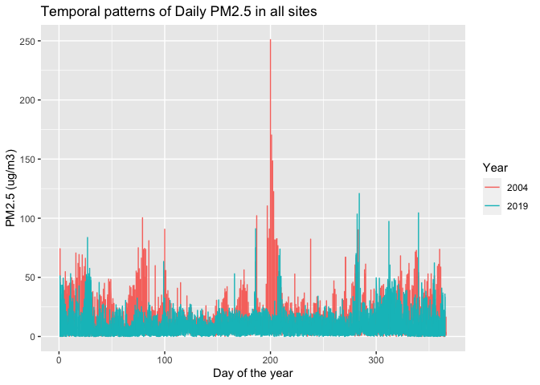

pm566_HW1
================
Yuhong Hu
2022-09-22

# Introduction

The primary question you will answer is whether daily concentrations of
PM<sub>2.5</sub> (particulate matter air pollution with aerodynamic
diameter less than 2.5 μm) have decreased in California over the last 15
years (from 2004 to 2019).

# Q1

Read in the data using data.table(). For each of the two datasets, check
the dimensions, headers, footers, variable names and variable types.
Check for any data issues, particularly in the key variable we are
analyzing. Make sure you write up a summary of all of your findings.

## Read in dataset

``` r
pm04 <- fread("~/Desktop/PhD course/pm 566/pm566_hw/HW1/ad_viz_plotval_data_2004.csv")
pm19 <- fread("~/Desktop/PhD course/pm 566/pm566_hw/HW1/ad_viz_plotval_data_2019.csv")
class(pm04)
```

    ## [1] "data.table" "data.frame"

``` r
class(pm19)
```

    ## [1] "data.table" "data.frame"

Both datasets were in the format of data.table or data.frame.

## Check for 2004 data

In PM<sub>2.5</sub> 2004 dataset, there are 20 variables and 19233
observations. There were 8 character variables and 12 numeric
variables.All the variable we are going to use is in right format and
type, except for Date, which we are going to change it from character
class to correct date format. No missing value were found for key
variables (Date, Sitename, county,Daily Mean PM<sub>2.5</sub>
Concentration) we are going to use. Based on the summary statistics
(using skim function), no obvious outlier was found for most of the key
variables. However, according to subject matter knowledge, the
concentration of PM<sub>2.5</sub> cannot be under 0. Thus, we exclude
observation with PM<sub>2.5</sub> \< 0 (N=1).The very large
PM<sub>2.5</sub> value (e.g., maximum 251 μg/m<sup>3</sup>) is still
plausible, though very abnormal.

``` r
dim(pm04)
```

    ## [1] 19233    20

``` r
head(pm04)
```

    ##          Date Source  Site ID POC Daily Mean PM2.5 Concentration    UNITS
    ## 1: 01/01/2004    AQS 60010007   1                            8.9 ug/m3 LC
    ## 2: 01/02/2004    AQS 60010007   1                           12.2 ug/m3 LC
    ## 3: 01/03/2004    AQS 60010007   1                           16.5 ug/m3 LC
    ## 4: 01/04/2004    AQS 60010007   1                           19.5 ug/m3 LC
    ## 5: 01/05/2004    AQS 60010007   1                           11.5 ug/m3 LC
    ## 6: 01/06/2004    AQS 60010007   1                           32.5 ug/m3 LC
    ##    DAILY_AQI_VALUE Site Name DAILY_OBS_COUNT PERCENT_COMPLETE
    ## 1:              37 Livermore               1              100
    ## 2:              51 Livermore               1              100
    ## 3:              60 Livermore               1              100
    ## 4:              67 Livermore               1              100
    ## 5:              48 Livermore               1              100
    ## 6:              94 Livermore               1              100
    ##    AQS_PARAMETER_CODE                     AQS_PARAMETER_DESC CBSA_CODE
    ## 1:              88101               PM2.5 - Local Conditions     41860
    ## 2:              88502 Acceptable PM2.5 AQI & Speciation Mass     41860
    ## 3:              88502 Acceptable PM2.5 AQI & Speciation Mass     41860
    ## 4:              88502 Acceptable PM2.5 AQI & Speciation Mass     41860
    ## 5:              88502 Acceptable PM2.5 AQI & Speciation Mass     41860
    ## 6:              88502 Acceptable PM2.5 AQI & Speciation Mass     41860
    ##                            CBSA_NAME STATE_CODE      STATE COUNTY_CODE  COUNTY
    ## 1: San Francisco-Oakland-Hayward, CA          6 California           1 Alameda
    ## 2: San Francisco-Oakland-Hayward, CA          6 California           1 Alameda
    ## 3: San Francisco-Oakland-Hayward, CA          6 California           1 Alameda
    ## 4: San Francisco-Oakland-Hayward, CA          6 California           1 Alameda
    ## 5: San Francisco-Oakland-Hayward, CA          6 California           1 Alameda
    ## 6: San Francisco-Oakland-Hayward, CA          6 California           1 Alameda
    ##    SITE_LATITUDE SITE_LONGITUDE
    ## 1:      37.68753      -121.7842
    ## 2:      37.68753      -121.7842
    ## 3:      37.68753      -121.7842
    ## 4:      37.68753      -121.7842
    ## 5:      37.68753      -121.7842
    ## 6:      37.68753      -121.7842

``` r
tail(pm04)
```

    ##          Date Source  Site ID POC Daily Mean PM2.5 Concentration    UNITS
    ## 1: 12/14/2004    AQS 61131003   1                             11 ug/m3 LC
    ## 2: 12/17/2004    AQS 61131003   1                             16 ug/m3 LC
    ## 3: 12/20/2004    AQS 61131003   1                             17 ug/m3 LC
    ## 4: 12/23/2004    AQS 61131003   1                              9 ug/m3 LC
    ## 5: 12/26/2004    AQS 61131003   1                             24 ug/m3 LC
    ## 6: 12/29/2004    AQS 61131003   1                              9 ug/m3 LC
    ##    DAILY_AQI_VALUE            Site Name DAILY_OBS_COUNT PERCENT_COMPLETE
    ## 1:              46 Woodland-Gibson Road               1              100
    ## 2:              59 Woodland-Gibson Road               1              100
    ## 3:              61 Woodland-Gibson Road               1              100
    ## 4:              38 Woodland-Gibson Road               1              100
    ## 5:              76 Woodland-Gibson Road               1              100
    ## 6:              38 Woodland-Gibson Road               1              100
    ##    AQS_PARAMETER_CODE       AQS_PARAMETER_DESC CBSA_CODE
    ## 1:              88101 PM2.5 - Local Conditions     40900
    ## 2:              88101 PM2.5 - Local Conditions     40900
    ## 3:              88101 PM2.5 - Local Conditions     40900
    ## 4:              88101 PM2.5 - Local Conditions     40900
    ## 5:              88101 PM2.5 - Local Conditions     40900
    ## 6:              88101 PM2.5 - Local Conditions     40900
    ##                                  CBSA_NAME STATE_CODE      STATE COUNTY_CODE
    ## 1: Sacramento--Roseville--Arden-Arcade, CA          6 California         113
    ## 2: Sacramento--Roseville--Arden-Arcade, CA          6 California         113
    ## 3: Sacramento--Roseville--Arden-Arcade, CA          6 California         113
    ## 4: Sacramento--Roseville--Arden-Arcade, CA          6 California         113
    ## 5: Sacramento--Roseville--Arden-Arcade, CA          6 California         113
    ## 6: Sacramento--Roseville--Arden-Arcade, CA          6 California         113
    ##    COUNTY SITE_LATITUDE SITE_LONGITUDE
    ## 1:   Yolo      38.66121      -121.7327
    ## 2:   Yolo      38.66121      -121.7327
    ## 3:   Yolo      38.66121      -121.7327
    ## 4:   Yolo      38.66121      -121.7327
    ## 5:   Yolo      38.66121      -121.7327
    ## 6:   Yolo      38.66121      -121.7327

``` r
colnames(pm04)
```

    ##  [1] "Date"                           "Source"                        
    ##  [3] "Site ID"                        "POC"                           
    ##  [5] "Daily Mean PM2.5 Concentration" "UNITS"                         
    ##  [7] "DAILY_AQI_VALUE"                "Site Name"                     
    ##  [9] "DAILY_OBS_COUNT"                "PERCENT_COMPLETE"              
    ## [11] "AQS_PARAMETER_CODE"             "AQS_PARAMETER_DESC"            
    ## [13] "CBSA_CODE"                      "CBSA_NAME"                     
    ## [15] "STATE_CODE"                     "STATE"                         
    ## [17] "COUNTY_CODE"                    "COUNTY"                        
    ## [19] "SITE_LATITUDE"                  "SITE_LONGITUDE"

``` r
str(pm04)
```

    ## Classes 'data.table' and 'data.frame':   19233 obs. of  20 variables:
    ##  $ Date                          : chr  "01/01/2004" "01/02/2004" "01/03/2004" "01/04/2004" ...
    ##  $ Source                        : chr  "AQS" "AQS" "AQS" "AQS" ...
    ##  $ Site ID                       : int  60010007 60010007 60010007 60010007 60010007 60010007 60010007 60010007 60010007 60010007 ...
    ##  $ POC                           : int  1 1 1 1 1 1 1 1 1 1 ...
    ##  $ Daily Mean PM2.5 Concentration: num  8.9 12.2 16.5 19.5 11.5 32.5 15.5 29.9 21 15.7 ...
    ##  $ UNITS                         : chr  "ug/m3 LC" "ug/m3 LC" "ug/m3 LC" "ug/m3 LC" ...
    ##  $ DAILY_AQI_VALUE               : int  37 51 60 67 48 94 58 88 70 59 ...
    ##  $ Site Name                     : chr  "Livermore" "Livermore" "Livermore" "Livermore" ...
    ##  $ DAILY_OBS_COUNT               : int  1 1 1 1 1 1 1 1 1 1 ...
    ##  $ PERCENT_COMPLETE              : num  100 100 100 100 100 100 100 100 100 100 ...
    ##  $ AQS_PARAMETER_CODE            : int  88101 88502 88502 88502 88502 88502 88502 88502 88502 88101 ...
    ##  $ AQS_PARAMETER_DESC            : chr  "PM2.5 - Local Conditions" "Acceptable PM2.5 AQI & Speciation Mass" "Acceptable PM2.5 AQI & Speciation Mass" "Acceptable PM2.5 AQI & Speciation Mass" ...
    ##  $ CBSA_CODE                     : int  41860 41860 41860 41860 41860 41860 41860 41860 41860 41860 ...
    ##  $ CBSA_NAME                     : chr  "San Francisco-Oakland-Hayward, CA" "San Francisco-Oakland-Hayward, CA" "San Francisco-Oakland-Hayward, CA" "San Francisco-Oakland-Hayward, CA" ...
    ##  $ STATE_CODE                    : int  6 6 6 6 6 6 6 6 6 6 ...
    ##  $ STATE                         : chr  "California" "California" "California" "California" ...
    ##  $ COUNTY_CODE                   : int  1 1 1 1 1 1 1 1 1 1 ...
    ##  $ COUNTY                        : chr  "Alameda" "Alameda" "Alameda" "Alameda" ...
    ##  $ SITE_LATITUDE                 : num  37.7 37.7 37.7 37.7 37.7 ...
    ##  $ SITE_LONGITUDE                : num  -122 -122 -122 -122 -122 ...
    ##  - attr(*, ".internal.selfref")=<externalptr>

``` r
skim(pm04)
```

|                                                  |       |
|:-------------------------------------------------|:------|
| Name                                             | pm04  |
| Number of rows                                   | 19233 |
| Number of columns                                | 20    |
| Key                                              | NULL  |
| \_\_\_\_\_\_\_\_\_\_\_\_\_\_\_\_\_\_\_\_\_\_\_   |       |
| Column type frequency:                           |       |
| character                                        | 8     |
| numeric                                          | 12    |
| \_\_\_\_\_\_\_\_\_\_\_\_\_\_\_\_\_\_\_\_\_\_\_\_ |       |
| Group variables                                  | None  |

Data summary

**Variable type: character**

| skim_variable      | n_missing | complete_rate | min | max | empty | n_unique | whitespace |
|:-------------------|----------:|--------------:|----:|----:|------:|---------:|-----------:|
| Date               |         0 |             1 |  10 |  10 |     0 |      366 |          0 |
| Source             |         0 |             1 |   3 |   3 |     0 |        1 |          0 |
| UNITS              |         0 |             1 |   8 |   8 |     0 |        1 |          0 |
| Site Name          |         0 |             1 |   0 |  49 |   229 |      105 |          0 |
| AQS_PARAMETER_DESC |         0 |             1 |  24 |  38 |     0 |        2 |          0 |
| CBSA_NAME          |         0 |             1 |   0 |  45 |  1253 |       31 |          0 |
| STATE              |         0 |             1 |  10 |  10 |     0 |        1 |          0 |
| COUNTY             |         0 |             1 |   4 |  15 |     0 |       47 |          0 |

**Variable type: numeric**

| skim_variable                  | n_missing | complete_rate |        mean |        sd |          p0 |         p25 |         p50 |         p75 |        p100 | hist  |
|:-------------------------------|----------:|--------------:|------------:|----------:|------------:|------------:|------------:|------------:|------------:|:------|
| Site ID                        |         0 |          1.00 | 60588026.13 | 296496.39 | 60010007.00 | 60370002.00 | 60658001.00 | 60750006.00 | 61131003.00 | ▅▇▇▇▅ |
| POC                            |         0 |          1.00 |        1.82 |      1.81 |        1.00 |        1.00 |        1.00 |        2.00 |       12.00 | ▇▁▁▁▁ |
| Daily Mean PM2.5 Concentration |         0 |          1.00 |       13.13 |     10.93 |       -0.10 |        6.00 |       10.10 |       16.30 |      251.00 | ▇▁▁▁▁ |
| DAILY_AQI_VALUE                |         0 |          1.00 |       46.33 |     28.18 |        0.00 |       25.00 |       42.00 |       60.00 |      301.00 | ▇▂▁▁▁ |
| DAILY_OBS_COUNT                |         0 |          1.00 |        1.00 |      0.00 |        1.00 |        1.00 |        1.00 |        1.00 |        1.00 | ▁▁▇▁▁ |
| PERCENT_COMPLETE               |         0 |          1.00 |      100.00 |      0.00 |      100.00 |      100.00 |      100.00 |      100.00 |      100.00 | ▁▁▇▁▁ |
| AQS_PARAMETER_CODE             |         0 |          1.00 |    88267.82 |    197.66 |    88101.00 |    88101.00 |    88101.00 |    88502.00 |    88502.00 | ▇▁▁▁▆ |
| CBSA_CODE                      |      1253 |          0.93 |    35327.51 |  10055.90 |    12540.00 |    31080.00 |    40140.00 |    41860.00 |    49700.00 | ▂▁▂▇▂ |
| STATE_CODE                     |         0 |          1.00 |        6.00 |      0.00 |        6.00 |        6.00 |        6.00 |        6.00 |        6.00 | ▁▁▇▁▁ |
| COUNTY_CODE                    |         0 |          1.00 |       58.63 |     29.66 |        1.00 |       37.00 |       65.00 |       75.00 |      113.00 | ▅▇▇▇▅ |
| SITE_LATITUDE                  |         0 |          1.00 |       36.23 |      2.29 |       32.63 |       34.07 |       36.48 |       38.10 |       41.71 | ▇▂▆▅▁ |
| SITE_LONGITUDE                 |         0 |          1.00 |     -119.65 |      2.01 |     -124.16 |     -121.62 |     -119.29 |     -117.94 |     -115.48 | ▁▇▅▆▃ |

``` r
# exclude pm2.5<0
pm04 <- pm04[pm04$`Daily Mean PM2.5 Concentration`>=0,]
dim(pm04)
```

    ## [1] 19232    20

## Check for 2019 data

In PM<sub>2.5</sub> 2019 dataset, there are 20 variables and 53156
observations. There were 8 character variables and 12 numeric
variables.All the variable we are going to use is in right format and
type, except for Date, which we are going to change it from character
class to correct date format. No missing value were found for key
variables (Date, Sitename, county,Daily Mean PM<sub>2.5</sub>
concentration) we are going to use.Based on the summary statistics, no
obvious outlier was found.Based on the summary statistics (using skim
function), no obvious outlier was found for most of the key variables.
However, according to subject matter knowledge, the concentration of
PM<sub>2.5</sub> cannot be under 0. Thus, we exclude observation with
PM<sub>2.5</sub> \< 0 (N=282).

``` r
dim(pm19)
```

    ## [1] 53156    20

``` r
head(pm19)
```

    ##          Date Source  Site ID POC Daily Mean PM2.5 Concentration    UNITS
    ## 1: 01/01/2019    AQS 60010007   3                            5.7 ug/m3 LC
    ## 2: 01/02/2019    AQS 60010007   3                           11.9 ug/m3 LC
    ## 3: 01/03/2019    AQS 60010007   3                           20.1 ug/m3 LC
    ## 4: 01/04/2019    AQS 60010007   3                           28.8 ug/m3 LC
    ## 5: 01/05/2019    AQS 60010007   3                           11.2 ug/m3 LC
    ## 6: 01/06/2019    AQS 60010007   3                            2.7 ug/m3 LC
    ##    DAILY_AQI_VALUE Site Name DAILY_OBS_COUNT PERCENT_COMPLETE
    ## 1:              24 Livermore               1              100
    ## 2:              50 Livermore               1              100
    ## 3:              68 Livermore               1              100
    ## 4:              86 Livermore               1              100
    ## 5:              47 Livermore               1              100
    ## 6:              11 Livermore               1              100
    ##    AQS_PARAMETER_CODE       AQS_PARAMETER_DESC CBSA_CODE
    ## 1:              88101 PM2.5 - Local Conditions     41860
    ## 2:              88101 PM2.5 - Local Conditions     41860
    ## 3:              88101 PM2.5 - Local Conditions     41860
    ## 4:              88101 PM2.5 - Local Conditions     41860
    ## 5:              88101 PM2.5 - Local Conditions     41860
    ## 6:              88101 PM2.5 - Local Conditions     41860
    ##                            CBSA_NAME STATE_CODE      STATE COUNTY_CODE  COUNTY
    ## 1: San Francisco-Oakland-Hayward, CA          6 California           1 Alameda
    ## 2: San Francisco-Oakland-Hayward, CA          6 California           1 Alameda
    ## 3: San Francisco-Oakland-Hayward, CA          6 California           1 Alameda
    ## 4: San Francisco-Oakland-Hayward, CA          6 California           1 Alameda
    ## 5: San Francisco-Oakland-Hayward, CA          6 California           1 Alameda
    ## 6: San Francisco-Oakland-Hayward, CA          6 California           1 Alameda
    ##    SITE_LATITUDE SITE_LONGITUDE
    ## 1:      37.68753      -121.7842
    ## 2:      37.68753      -121.7842
    ## 3:      37.68753      -121.7842
    ## 4:      37.68753      -121.7842
    ## 5:      37.68753      -121.7842
    ## 6:      37.68753      -121.7842

``` r
tail(pm19)
```

    ##          Date Source  Site ID POC Daily Mean PM2.5 Concentration    UNITS
    ## 1: 11/11/2019    AQS 61131003   1                           13.5 ug/m3 LC
    ## 2: 11/17/2019    AQS 61131003   1                           18.1 ug/m3 LC
    ## 3: 11/29/2019    AQS 61131003   1                           12.5 ug/m3 LC
    ## 4: 12/17/2019    AQS 61131003   1                           23.8 ug/m3 LC
    ## 5: 12/23/2019    AQS 61131003   1                            1.0 ug/m3 LC
    ## 6: 12/29/2019    AQS 61131003   1                            9.1 ug/m3 LC
    ##    DAILY_AQI_VALUE            Site Name DAILY_OBS_COUNT PERCENT_COMPLETE
    ## 1:              54 Woodland-Gibson Road               1              100
    ## 2:              64 Woodland-Gibson Road               1              100
    ## 3:              52 Woodland-Gibson Road               1              100
    ## 4:              76 Woodland-Gibson Road               1              100
    ## 5:               4 Woodland-Gibson Road               1              100
    ## 6:              38 Woodland-Gibson Road               1              100
    ##    AQS_PARAMETER_CODE       AQS_PARAMETER_DESC CBSA_CODE
    ## 1:              88101 PM2.5 - Local Conditions     40900
    ## 2:              88101 PM2.5 - Local Conditions     40900
    ## 3:              88101 PM2.5 - Local Conditions     40900
    ## 4:              88101 PM2.5 - Local Conditions     40900
    ## 5:              88101 PM2.5 - Local Conditions     40900
    ## 6:              88101 PM2.5 - Local Conditions     40900
    ##                                  CBSA_NAME STATE_CODE      STATE COUNTY_CODE
    ## 1: Sacramento--Roseville--Arden-Arcade, CA          6 California         113
    ## 2: Sacramento--Roseville--Arden-Arcade, CA          6 California         113
    ## 3: Sacramento--Roseville--Arden-Arcade, CA          6 California         113
    ## 4: Sacramento--Roseville--Arden-Arcade, CA          6 California         113
    ## 5: Sacramento--Roseville--Arden-Arcade, CA          6 California         113
    ## 6: Sacramento--Roseville--Arden-Arcade, CA          6 California         113
    ##    COUNTY SITE_LATITUDE SITE_LONGITUDE
    ## 1:   Yolo      38.66121      -121.7327
    ## 2:   Yolo      38.66121      -121.7327
    ## 3:   Yolo      38.66121      -121.7327
    ## 4:   Yolo      38.66121      -121.7327
    ## 5:   Yolo      38.66121      -121.7327
    ## 6:   Yolo      38.66121      -121.7327

``` r
colnames(pm19)
```

    ##  [1] "Date"                           "Source"                        
    ##  [3] "Site ID"                        "POC"                           
    ##  [5] "Daily Mean PM2.5 Concentration" "UNITS"                         
    ##  [7] "DAILY_AQI_VALUE"                "Site Name"                     
    ##  [9] "DAILY_OBS_COUNT"                "PERCENT_COMPLETE"              
    ## [11] "AQS_PARAMETER_CODE"             "AQS_PARAMETER_DESC"            
    ## [13] "CBSA_CODE"                      "CBSA_NAME"                     
    ## [15] "STATE_CODE"                     "STATE"                         
    ## [17] "COUNTY_CODE"                    "COUNTY"                        
    ## [19] "SITE_LATITUDE"                  "SITE_LONGITUDE"

``` r
str(pm19)
```

    ## Classes 'data.table' and 'data.frame':   53156 obs. of  20 variables:
    ##  $ Date                          : chr  "01/01/2019" "01/02/2019" "01/03/2019" "01/04/2019" ...
    ##  $ Source                        : chr  "AQS" "AQS" "AQS" "AQS" ...
    ##  $ Site ID                       : int  60010007 60010007 60010007 60010007 60010007 60010007 60010007 60010007 60010007 60010007 ...
    ##  $ POC                           : int  3 3 3 3 3 3 3 3 3 3 ...
    ##  $ Daily Mean PM2.5 Concentration: num  5.7 11.9 20.1 28.8 11.2 2.7 2.8 7 3.1 7.1 ...
    ##  $ UNITS                         : chr  "ug/m3 LC" "ug/m3 LC" "ug/m3 LC" "ug/m3 LC" ...
    ##  $ DAILY_AQI_VALUE               : int  24 50 68 86 47 11 12 29 13 30 ...
    ##  $ Site Name                     : chr  "Livermore" "Livermore" "Livermore" "Livermore" ...
    ##  $ DAILY_OBS_COUNT               : int  1 1 1 1 1 1 1 1 1 1 ...
    ##  $ PERCENT_COMPLETE              : num  100 100 100 100 100 100 100 100 100 100 ...
    ##  $ AQS_PARAMETER_CODE            : int  88101 88101 88101 88101 88101 88101 88101 88101 88101 88101 ...
    ##  $ AQS_PARAMETER_DESC            : chr  "PM2.5 - Local Conditions" "PM2.5 - Local Conditions" "PM2.5 - Local Conditions" "PM2.5 - Local Conditions" ...
    ##  $ CBSA_CODE                     : int  41860 41860 41860 41860 41860 41860 41860 41860 41860 41860 ...
    ##  $ CBSA_NAME                     : chr  "San Francisco-Oakland-Hayward, CA" "San Francisco-Oakland-Hayward, CA" "San Francisco-Oakland-Hayward, CA" "San Francisco-Oakland-Hayward, CA" ...
    ##  $ STATE_CODE                    : int  6 6 6 6 6 6 6 6 6 6 ...
    ##  $ STATE                         : chr  "California" "California" "California" "California" ...
    ##  $ COUNTY_CODE                   : int  1 1 1 1 1 1 1 1 1 1 ...
    ##  $ COUNTY                        : chr  "Alameda" "Alameda" "Alameda" "Alameda" ...
    ##  $ SITE_LATITUDE                 : num  37.7 37.7 37.7 37.7 37.7 ...
    ##  $ SITE_LONGITUDE                : num  -122 -122 -122 -122 -122 ...
    ##  - attr(*, ".internal.selfref")=<externalptr>

``` r
skim(pm19)
```

|                                                  |       |
|:-------------------------------------------------|:------|
| Name                                             | pm19  |
| Number of rows                                   | 53156 |
| Number of columns                                | 20    |
| Key                                              | NULL  |
| \_\_\_\_\_\_\_\_\_\_\_\_\_\_\_\_\_\_\_\_\_\_\_   |       |
| Column type frequency:                           |       |
| character                                        | 8     |
| numeric                                          | 12    |
| \_\_\_\_\_\_\_\_\_\_\_\_\_\_\_\_\_\_\_\_\_\_\_\_ |       |
| Group variables                                  | None  |

Data summary

**Variable type: character**

| skim_variable      | n_missing | complete_rate | min | max | empty | n_unique | whitespace |
|:-------------------|----------:|--------------:|----:|----:|------:|---------:|-----------:|
| Date               |         0 |             1 |  10 |  10 |     0 |      365 |          0 |
| Source             |         0 |             1 |   3 |   3 |     0 |        1 |          0 |
| UNITS              |         0 |             1 |   8 |   8 |     0 |        1 |          0 |
| Site Name          |         0 |             1 |   0 |  49 |   102 |      159 |          0 |
| AQS_PARAMETER_DESC |         0 |             1 |  24 |  38 |     0 |        2 |          0 |
| CBSA_NAME          |         0 |             1 |   0 |  45 |  4181 |       34 |          0 |
| STATE              |         0 |             1 |  10 |  10 |     0 |        1 |          0 |
| COUNTY             |         0 |             1 |   4 |  15 |     0 |       51 |          0 |

**Variable type: numeric**

| skim_variable                  | n_missing | complete_rate |        mean |        sd |          p0 |         p25 |         p50 |         p75 |        p100 | hist  |
|:-------------------------------|----------:|--------------:|------------:|----------:|------------:|------------:|------------:|------------:|------------:|:------|
| Site ID                        |         0 |          1.00 | 60565263.58 | 300193.08 | 60010007.00 | 60310004.00 | 60612003.00 | 60771002.00 | 61131003.00 | ▆▇▇▇▅ |
| POC                            |         0 |          1.00 |        2.57 |      1.75 |        1.00 |        1.00 |        3.00 |        3.00 |       21.00 | ▇▁▁▁▁ |
| Daily Mean PM2.5 Concentration |         0 |          1.00 |        7.74 |      5.82 |       -2.20 |        4.00 |        6.50 |        9.90 |      120.90 | ▇▁▁▁▁ |
| DAILY_AQI_VALUE                |         0 |          1.00 |       30.58 |     18.78 |        0.00 |       17.00 |       27.00 |       41.00 |      185.00 | ▇▃▁▁▁ |
| DAILY_OBS_COUNT                |         0 |          1.00 |        1.00 |      0.00 |        1.00 |        1.00 |        1.00 |        1.00 |        1.00 | ▁▁▇▁▁ |
| PERCENT_COMPLETE               |         0 |          1.00 |      100.00 |      0.00 |      100.00 |      100.00 |      100.00 |      100.00 |      100.00 | ▁▁▇▁▁ |
| AQS_PARAMETER_CODE             |         0 |          1.00 |    88213.74 |    180.28 |    88101.00 |    88101.00 |    88101.00 |    88502.00 |    88502.00 | ▇▁▁▁▃ |
| CBSA_CODE                      |      4181 |          0.92 |    35839.23 |   9403.80 |    12540.00 |    31080.00 |    40140.00 |    41860.00 |    49700.00 | ▂▂▂▇▂ |
| STATE_CODE                     |         0 |          1.00 |        6.00 |      0.00 |        6.00 |        6.00 |        6.00 |        6.00 |        6.00 | ▁▁▇▁▁ |
| COUNTY_CODE                    |         0 |          1.00 |       56.38 |     30.01 |        1.00 |       31.00 |       61.00 |       77.00 |      113.00 | ▆▇▇▇▅ |
| SITE_LATITUDE                  |         0 |          1.00 |       36.34 |      2.23 |       32.58 |       34.14 |       36.63 |       37.97 |       41.76 | ▇▃▇▅▁ |
| SITE_LONGITUDE                 |         0 |          1.00 |     -119.82 |      2.00 |     -124.20 |     -121.59 |     -119.80 |     -118.15 |     -115.48 | ▁▇▅▆▂ |

``` r
# exclude pm2.5<0
pm19 <- pm19[pm19$`Daily Mean PM2.5 Concentration`>=0,]
dim(pm19)
```

    ## [1] 52874    20

# Q2

Combine the two years of data into one data frame. Use the Date variable
to create a new column for year, which will serve as an identifier.
Change the names of the key variables so that they are easier to refer
to in your code.

``` r
pm04$year <- year(as.Date(pm04$Date,"%m/%d/%Y"))
pm19$year <- year(as.Date(pm19$Date,"%m/%d/%Y"))
# check whether the conversion was right
table(pm04$year)
```

    ## 
    ##  2004 
    ## 19232

``` r
table(pm19$year)
```

    ## 
    ##  2019 
    ## 52874

``` r
# Combine the two datasets
pm <- rbind(pm04,pm19)
dim(pm) # The number of observations = sum of the two datasets
```

    ## [1] 72106    21

``` r
# Rename some variables for convenience
pm <- pm %>%
  rename(pm25 = `Daily Mean PM2.5 Concentration`,
         countycode = COUNTY_CODE,
         county = COUNTY,
         site = `Site Name`,
         lat = SITE_LATITUDE,
         lon = SITE_LONGITUDE,
         )
```

# Q3

Create a basic map in leaflet() that shows the locations of the sites
(make sure to use different colors for each year). Summarize the spatial
distribution of the monitoring sites.

``` r
#update the two datasets 
pm04 <- pm %>%
  filter(year==2004)
pm19 <- pm %>%
  filter(year==2019)
# create unique sites for the two years
map04 <- (unique(pm04[,c("lat","lon")])) 
map19 <- (unique(pm19[,c("lat","lon")])) 

leaflet() %>% 
  addProviderTiles('CartoDB.Positron') %>% 
  addCircles(
    data = map04,
    lat = ~lat, lng = ~lon, popup = "2004",
    opacity = 1, fillOpacity = 1, radius = 300,color = 'blue'
    ) %>%
  addCircles(
    data = map19,
    lat = ~lat, lng = ~lon, popup = "2019",
    opacity=0.7, fillOpacity=0.7, radius = 300,color = 'orange'
    )
```

<!-- -->

As the monitor sites map shown above (sites of 2004 in blue, sites of
2019 in orange). The sites were concentrated in two big cites (Los
Angles, and San Francisco) and their surroundings. The low density of
sites were shown in some area close to state border (California-Arizona,
California-Nevada, California-Oregon).Sites in 2019 covered almost all
the monitor sites in 2004, and there were more sites put in use in 2019
compared to 2004. A very small proportion of sites in 2004 shut in 2019.

# Q4

Check for any missing or implausible values of PM<sub>2.5</sub> in the
combined dataset. Explore the proportions of each and provide a summary
of any temporal patterns you see in these observations.

We have explored NA and implausible value in Q1, here we would focus on
how the number of sites and counties with monitoring PM<sub>2.5</sub>
data change over time.

``` r
pm %>%
  filter(year==2004) %>%
  distinct(county) %>%
  nrow
```

    ## [1] 47

``` r
pm %>%
  filter(year==2019) %>%
  distinct(county) %>%
  nrow
```

    ## [1] 51

``` r
county19 <- unique(pm[pm$year==2019,'county'])
county04 <- unique(pm[pm$year==2004,'county'])
county19$county[!(county19$county %in% county04$county)]
```

    ## [1] "Glenn"  "Madera" "Napa"   "Tehama"

Compared to 2019 with 51 counties monitored, monitoring data from these
four counties (Glenn, Madera, Napa, Tehama) were missing for 2004.

``` r
pm %>%
  filter(year==2004) %>%
  distinct(site) %>%
  nrow
```

    ## [1] 105

``` r
pm %>%
  filter(year==2019) %>%
  distinct(site) %>%
  nrow
```

    ## [1] 159

``` r
site19 <- unique(pm[pm$year==2019,'site'])
site04 <- unique(pm[pm$year==2004,'site'])
```

Compared to 2019 with 159 monitoring sites, there were only 105
monitoring sites in 2004. 27 sites in 2004 were abandoned in 2019. See
below.

``` r
site04$site[!(site04$site %in% site19$site)]
```

    ##  [1] "Fremont - Chapel Way"                       
    ##  [2] "Chico-Manzanita Ave."                       
    ##  [3] "South Lake Tahoe-Sandy Way"                 
    ##  [4] "3425 N FIRST ST, FRESNO"                    
    ##  [5] "Eureka I Street"                            
    ##  [6] "Death Valley NP - Park Village"             
    ##  [7] "Ridgecrest-California Ave"                  
    ##  [8] "Lebec-Peace Valley Road"                    
    ##  [9] "Lakeport-Lakeport Blvd."                    
    ## [10] "Burbank"                                    
    ## [11] "Lynwood"                                    
    ## [12] "Portola-161 Nevada Street"                  
    ## [13] "Riverside (Magnolia)"                       
    ## [14] "Sacramento Health Department-Stockton Blvd."
    ## [15] "Ontario Fire Station"                       
    ## [16] "El Cajon"                                   
    ## [17] "Kearny Mesa"                                
    ## [18] "Escondido"                                  
    ## [19] "San Diego-12th Ave"                         
    ## [20] "La Posta Reservation"                       
    ## [21] "San Francisco - Bayview Hunters Point"      
    ## [22] "San Luis Obispo-Marsh St."                  
    ## [23] "Atascadero (original site)"                 
    ## [24] "San Jose"                                   
    ## [25] "Redding - Buckeye"                          
    ## [26] "Redding - Toyon"                            
    ## [27] "Santa Rosa - 5th St"

81 new sites were put into use in 2019 compared to 2004. See below.

``` r
site19$site[!(site19$site %in% site04$site)]
```

    ##  [1] "Oakland"                                          
    ##  [2] "Oakland West"                                     
    ##  [3] "Laney College"                                    
    ##  [4] "Berkeley- Aquatic Park"                           
    ##  [5] "Pleasanton - Owens Ct"                            
    ##  [6] "Chico-East Avenue"                                
    ##  [7] "Paradise - Theater"                               
    ##  [8] "Cortina Indian Rancheria"                         
    ##  [9] "San Pablo"                                        
    ## [10] "Crescent City-Crescent Elk School"                
    ## [11] "Lake Tahoe Community College"                     
    ## [12] "Fresno - Garland"                                 
    ## [13] "Table Mountain Air Monitoring Site"               
    ## [14] "Huron"                                            
    ## [15] "Tranquillity"                                     
    ## [16] "Willows-Colusa Street"                            
    ## [17] "Jacobs"                                           
    ## [18] "White Mountain Research Center - Owens Valley Lab"
    ## [19] "Ridgecrest-Ward"                                  
    ## [20] "Lebec-Peace Valley/Frazier Park Roads"            
    ## [21] "Hanford-Irwin"                                    
    ## [22] "Lakeport-S. Main Street"                          
    ## [23] "Glendora"                                         
    ## [24] "Compton"                                          
    ## [25] "Pico Rivera #2"                                   
    ## [26] "Long Beach-Route 710 Near Road"                   
    ## [27] "Santa Clarita"                                    
    ## [28] "Madera-City"                                      
    ## [29] "San Rafael"                                       
    ## [30] "Willits-125 East Commercial Street"               
    ## [31] "Merced-Coffee"                                    
    ## [32] "Lee Vining"                                       
    ## [33] "Carmel Valley"                                    
    ## [34] "King City 2"                                      
    ## [35] "Napa Valley College"                              
    ## [36] "Auburn-Atwood"                                    
    ## [37] "Colfax-City Hall"                                 
    ## [38] "Tahoe City-Fairway Drive"                         
    ## [39] "Lincoln-2885 Moore Road"                          
    ## [40] "Portola"                                          
    ## [41] "Pechanga"                                         
    ## [42] "Joshua Tree NP - Cottonwood Visitor Center"       
    ## [43] "Banning Airport"                                  
    ## [44] "Temecula"                                         
    ## [45] "29 Palms"                                         
    ## [46] "Morongo Air Monitoring Station"                   
    ## [47] "Mira Loma (Van Buren)"                            
    ## [48] "Lake Elsinore"                                    
    ## [49] "Folsom-Natoma St."                                
    ## [50] "Sacramento-Bercut Drive"                          
    ## [51] "Sloughhouse"                                      
    ## [52] "Hollister"                                        
    ## [53] "Crestline"                                        
    ## [54] "Ontario-Route 60 Near Road"                       
    ## [55] "Upland"                                           
    ## [56] "Alpine"                                           
    ## [57] "Camp Pendleton"                                   
    ## [58] "Donovan"                                          
    ## [59] "Kearny Villa Rd."                                 
    ## [60] "San Diego -Rancho Carmel Drive"                   
    ## [61] "El Cajon - Lexington Elementary School"           
    ## [62] "San Diego - Sherman Elementary School"            
    ## [63] "Pala Airpad"                                      
    ## [64] "Manteca"                                          
    ## [65] "Tracy-Airport"                                    
    ## [66] "Mesa2"                                            
    ## [67] "San Luis Obispo"                                  
    ## [68] "Arroyo Grande CDF"                                
    ## [69] "Atascadero"                                       
    ## [70] "Lompoc H Street"                                  
    ## [71] "Goleta"                                           
    ## [72] "Gilroy"                                           
    ## [73] "San Jose - Knox Avenue"                           
    ## [74] "San Lorenzo Valley Middle School"                 
    ## [75] "Yreka"                                            
    ## [76] "Sebastopol"                                       
    ## [77] "Turlock"                                          
    ## [78] "Red Bluff-Walnut St. District Office"             
    ## [79] "Weaverville-Courthouse"                           
    ## [80] "Porterville"                                      
    ## [81] "Ojai - East Ojai Ave"

Therefore, in general, monitoring data in 2019 covered more area than
2004. We also explored the temporal patterns of daily PM2.5 combining
obervations from all sites.

``` r
pm$Date <- as.Date(pm$Date,"%m/%d/%Y")
pm$yday <- yday(pm$Date)

ggplot(pm, aes(x=yday, y=pm25,color=as.factor(year))) +
  geom_line() +
  labs(title="Temporal patterns of Daily PM2.5 in all sites",
        x ="Day of the year", y = "PM2.5 (ug/m3)",
        color = "Year")
```

<!-- -->

For all the observations, we observed in both 2004 and 2019, the
PM<sub>2.5</sub> level fluctuates all year around. The relative low
levels were found in spring. The relative high levels were found in
winter and some periods of summer and fall.

# Q5

Explore the main question of interest at three different spatial levels.
Create exploratory plots (e.g. boxplots, histograms, line plots) and
summary statistics that best suit each level of data. Be sure to write
up explanations of what you observe in these data.

### State Level

``` r
statelevel <- pm %>%
  group_by(yday,year) %>%
  summarise(pm25av=mean(pm25))
```

    ## `summarise()` has grouped output by 'yday'. You can override using the
    ## `.groups` argument.

``` r
ggplot(statelevel, aes(x=yday, y=pm25av,color=as.factor(year))) +
  geom_line() +
  labs(title="Temporal patterns of Average Daily PM2.5",
        x ="Day of the year", y = "PM2.5 (ug/m3)",
        color = "Year")
```

<!-- -->

First, we averaged the daily PM<sub>2.5</sub> across all monitoring
sites in CA for each day in 2004 and 2019, and plotted the average daily
level on day of the year. By comparing the temporal patterns of daily
PM<sub>2.5</sub> level in 2004 and 2019, we observed a decrease in
PM<sub>2.5</sub> from 2004 to 2019 almost in each season at state level.

``` r
pm %>%
  group_by(year) %>%
  summarise(mean=mean(pm25),
            percentile25 = quantile(pm25,probs=0.25),
            median = median(pm25),
            percentile75 = quantile(pm25,probs=0.75),
            min = min(pm25),
            max = max(pm25)
            )
```

    ## # A tibble: 2 × 7
    ##    year  mean percentile25 median percentile75   min   max
    ##   <dbl> <dbl>        <dbl>  <dbl>        <dbl> <dbl> <dbl>
    ## 1  2004 13.1             6   10.1         16.3     0  251 
    ## 2  2019  7.79            4    6.5         10       0  121.

Also, by comparing mean, median, 25th percentile,75th percentile,
minimum and maximum of daily PM<sub>2.5</sub> combining all sites in
these two years, we observed a decrease in PM<sub>2.5</sub> from 2004 to
2019 at state level.

### County Level

``` r
length(unique(pm$countycode))
```

    ## [1] 51

``` r
# 51 different counties, not suitable for time-series plots
ggplot(pm,aes(x=county,y=pm25,color=as.factor(year)))+
  geom_boxplot()+
  labs(title="Daily PM2.5 distribution by county",
        x ="County", y = "PM2.5 (ug/m3)",
        color = "Year")+
  coord_flip()
```

<!-- -->

``` r
pm %>%
  group_by(county,year) %>%
  summarise(mean=mean(pm25),
            percentile25 = quantile(pm25,probs=0.25),
            median = median(pm25),
            percentile75 = quantile(pm25,probs=0.75),
            min = min(pm25),
            max = max(pm25)
            )
```

    ## `summarise()` has grouped output by 'county'. You can override using the
    ## `.groups` argument.

    ## # A tibble: 98 × 8
    ## # Groups:   county [51]
    ##    county        year  mean percentile25 median percentile75   min   max
    ##    <chr>        <dbl> <dbl>        <dbl>  <dbl>        <dbl> <dbl> <dbl>
    ##  1 Alameda       2004 11.1          6.02   8.95         12.8   1.4  49.6
    ##  2 Alameda       2019  7.34         4.4    6.5           9.4   0    29.3
    ##  3 Butte         2004 10.1          4.58   7.9          12     0.6  69  
    ##  4 Butte         2019  6.99         3.2    6             9     0    97.3
    ##  5 Calaveras     2004  7.61         5      7            10     1    24  
    ##  6 Calaveras     2019  5.46         3.7    5.2           6.8   0.7  24.8
    ##  7 Colusa        2004 10.0          4      7            13     0.6  44.6
    ##  8 Colusa        2019  6.61         3.88   5.8           8.2   0    27.5
    ##  9 Contra Costa  2004 12.8          5.45   8.6          17.4   2.1  73.7
    ## 10 Contra Costa  2019  7.20         4.5    6.4           9.1   0.3  35.9
    ## # … with 88 more rows

By comparing the overall distribution of daily PM<sub>2.5</sub> level
boxplots for each county (across whole year monitoring data) in 2004 and
2019, and by comparing mean, median, 25th percentile,75th percentile of
daily PM<sub>2.5</sub> in each county (across whole year monitoring
data) in these two years, we observed a decrease in daily
PM<sub>2.5</sub> from 2004 to 2019 in almost all the counties in
California with just a few exceptions.

### Site (in Los Angeles) Level

``` r
pmla <- pm[pm$county=='Los Angeles']
ggplot(pmla,aes(x=site,y=pm25,color=as.factor(year)))+
  geom_boxplot()+
  labs(title="Daily PM2.5 distribution by sites in LA",
        x ="Site", y = "PM2.5 (μg/m3)",
        color = "Year")+
  coord_flip()
```

<!-- -->

``` r
pmla %>%
  group_by(site,year) %>%
  summarise(mean=mean(pm25),
            percentile25 = quantile(pm25,probs=0.25),
            median = median(pm25),
            percentile75 = quantile(pm25,probs=0.75),
            min = min(pm25),
            max = max(pm25)
            )
```

    ## `summarise()` has grouped output by 'site'. You can override using the
    ## `.groups` argument.

    ## # A tibble: 24 × 8
    ## # Groups:   site [16]
    ##    site                  year  mean percentile25 median percentile75   min   max
    ##    <chr>                <dbl> <dbl>        <dbl>  <dbl>        <dbl> <dbl> <dbl>
    ##  1 ""                    2004 19.9         13.1   16.3         23.3    5    60.7
    ##  2 "Azusa"               2004 18.4         10.9   16.2         21.7    2    75.6
    ##  3 "Azusa"               2019  9.69         5.1    9           12.7    1.4  70.3
    ##  4 "Burbank"             2004 19.2         12.1   16           21.6    4    60.1
    ##  5 "Compton"             2019 11.0          7.7   10.5         13      1.9  39.5
    ##  6 "Glendora"            2019 11.9          7.1   10.8         15.4    3.3  75.1
    ##  7 "Lancaster-Division…  2004  8.50         6      9           11      1    18  
    ##  8 "Lancaster-Division…  2019  6.19         3.8    6.4          8.3    0    13.6
    ##  9 "Lebec"               2004  4.14         2.1    3.7          5.95   0.1  12.8
    ## 10 "Lebec"               2019  3.15         1.58   2.75         4.03   0.2  10.4
    ## # … with 14 more rows

By comparing the overall distribution of daily PM<sub>2.5</sub> level
boxplots (across whole year monitoring data) for each monitoring sites
in 2004 and 2019, and by comparing mean, median, 25th percentile,75th
percentile of daily PM<sub>2.5</sub> in each site in LA in these two
years, we observed a decrease in daily PM<sub>2.5</sub> from 2004 to
2019 in each site in LA.
