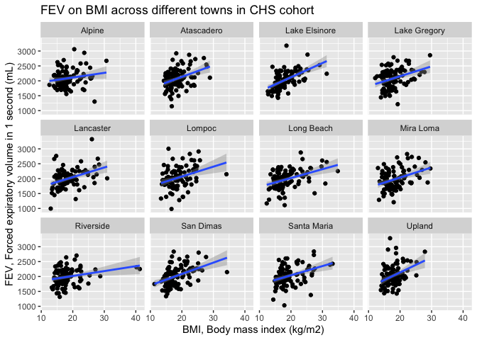
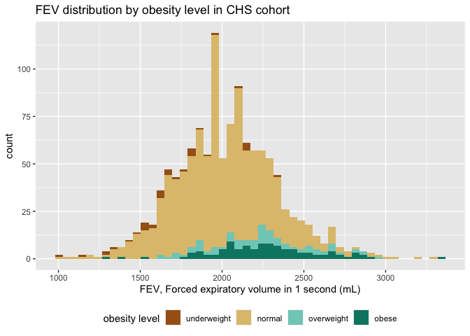
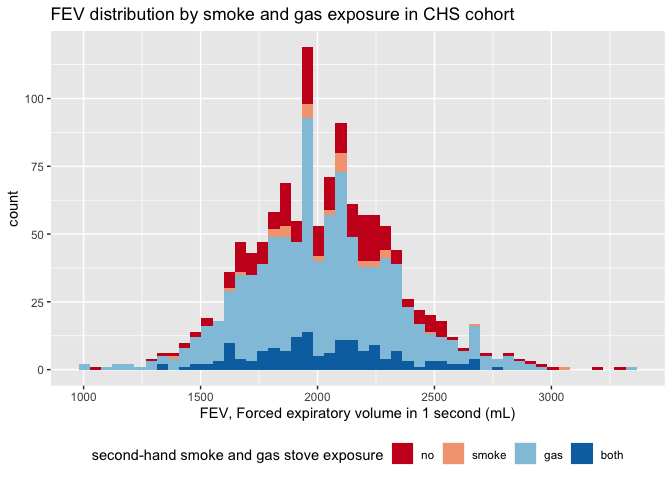
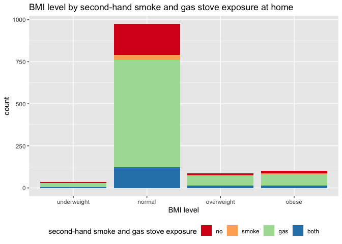
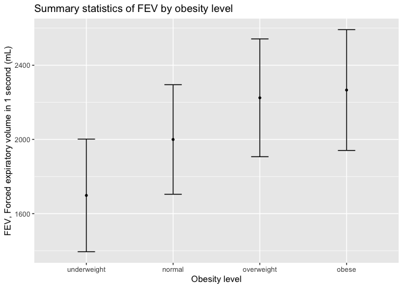
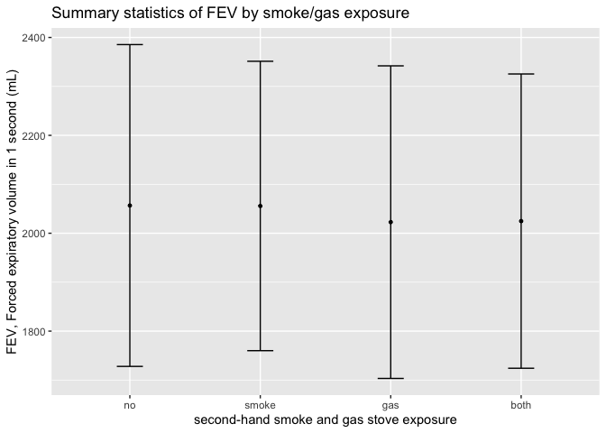
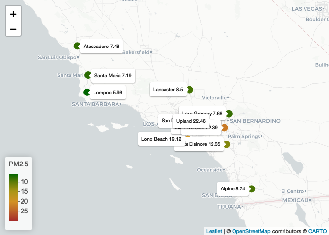
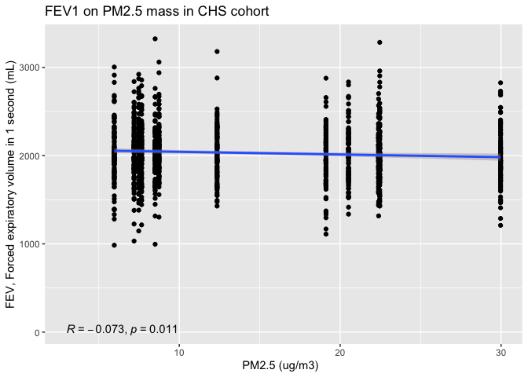

PM566_HW2
================
Yuhong Hu
2022-10-06

# Data Wrangling

You will need to download two datasets from
<https://github.com/USCbiostats/data-science-data>. The individual and
regional CHS datasets in 01_chs. The individual data includes personal
and health characteristics of children in 12 communities across Southern
California. The regional data include air quality measurements at the
community level. Once downloaded, you can merge these datasets using the
location variable. Once combined, you will need to do the following:

## Q1

After merging the data, make sure you don’t have any duplicates by
counting the number of rows. Make sure it matches.

In the case of missing values, impute data using the average within the
variables “male” and “hispanic.” If you are interested (and feel
adventurous) in the theme of Data Imputation, take a look at this paper
on “Multiple Imputation” using the Amelia R package here.

``` r
# Download the dataset
if (!file.exists("~/Desktop/PhD course/pm 566/pm566_hw/HW2/01_chs")){
  download.file(
    url = "https://raw.githubusercontent.com/USCbiostats/data-science-data/master/01_chs/chs_individual.csv",
    destfile = 'chs_individual.csv',
    method   = "libcurl",
    timeout  = 60
  )}

if (!file.exists("~/Desktop/PhD course/pm 566/pm566_hw/HW2/01_chs")){
  download.file(
    url = "https://raw.githubusercontent.com/USCbiostats/data-science-data/master/01_chs/chs_regional.csv",
    destfile = 'chs_regional.csv',
    method   = "libcurl",
    timeout  = 60
  )}


# read in the dataset
chsi <- data.table::fread("~/Desktop/PhD course/pm 566/pm566_hw/HW2/chs_individual.csv")
chsr <- data.table::fread("~/Desktop/PhD course/pm 566/pm566_hw/HW2/chs_regional.csv")

# merge the dataset
chs <- merge(
  x = chsi,      
  y = chsr, 
  by.x = "townname",
  by.y = "townname", 
  all.x = TRUE,      
  all.y = FALSE
  )
dim(chsi)
```

    ## [1] 1200   23

``` r
dim(chs)
```

    ## [1] 1200   49

Since the numbers of rows match between combined dataset and individual
dataset, we conclude we don’t have any duplicates.

``` r
#imputation
## first check the missing data
skim(chs)
```

|                                                  |          |
|:-------------------------------------------------|:---------|
| Name                                             | chs      |
| Number of rows                                   | 1200     |
| Number of columns                                | 49       |
| Key                                              | townname |
| \_\_\_\_\_\_\_\_\_\_\_\_\_\_\_\_\_\_\_\_\_\_\_   |          |
| Column type frequency:                           |          |
| character                                        | 2        |
| numeric                                          | 47       |
| \_\_\_\_\_\_\_\_\_\_\_\_\_\_\_\_\_\_\_\_\_\_\_\_ |          |
| Group variables                                  | None     |

Data summary

**Variable type: character**

| skim_variable | n_missing | complete_rate | min | max | empty | n_unique | whitespace |
|:--------------|----------:|--------------:|----:|----:|------:|---------:|-----------:|
| townname      |         0 |             1 |   6 |  13 |     0 |       12 |          0 |
| race          |         0 |             1 |   1 |   1 |     0 |        6 |          0 |

**Variable type: numeric**

| skim_variable | n_missing | complete_rate |    mean |     sd |      p0 |     p25 |     p50 |     p75 |    p100 | hist  |
|:--------------|----------:|--------------:|--------:|-------:|--------:|--------:|--------:|--------:|--------:|:------|
| sid           |         0 |          1.00 | 1037.52 | 592.75 |    1.00 |  528.75 | 1041.50 | 1554.25 | 2053.00 | ▇▇▇▇▇ |
| male          |         0 |          1.00 |    0.49 |   0.50 |    0.00 |    0.00 |    0.00 |    1.00 |    1.00 | ▇▁▁▁▇ |
| hispanic      |         0 |          1.00 |    0.43 |   0.50 |    0.00 |    0.00 |    0.00 |    1.00 |    1.00 | ▇▁▁▁▆ |
| agepft        |        89 |          0.93 |    9.92 |   0.43 |    8.96 |    9.61 |    9.91 |   10.18 |   12.73 | ▅▇▁▁▁ |
| height        |        89 |          0.93 |  138.96 |   6.74 |  114.00 |  135.00 |  139.00 |  143.00 |  165.00 | ▁▃▇▂▁ |
| weight        |        89 |          0.93 |   79.33 |  20.68 |   42.00 |   65.00 |   74.00 |   89.00 |  207.00 | ▇▆▁▁▁ |
| bmi           |        89 |          0.93 |   18.50 |   3.78 |   11.30 |   15.78 |   17.48 |   20.35 |   41.27 | ▇▇▂▁▁ |
| asthma        |        31 |          0.97 |    0.15 |   0.35 |    0.00 |    0.00 |    0.00 |    0.00 |    1.00 | ▇▁▁▁▂ |
| active_asthma |         0 |          1.00 |    0.19 |   0.39 |    0.00 |    0.00 |    0.00 |    0.00 |    1.00 | ▇▁▁▁▂ |
| father_asthma |       106 |          0.91 |    0.08 |   0.28 |    0.00 |    0.00 |    0.00 |    0.00 |    1.00 | ▇▁▁▁▁ |
| mother_asthma |        56 |          0.95 |    0.10 |   0.30 |    0.00 |    0.00 |    0.00 |    0.00 |    1.00 | ▇▁▁▁▁ |
| wheeze        |        71 |          0.94 |    0.33 |   0.47 |    0.00 |    0.00 |    0.00 |    1.00 |    1.00 | ▇▁▁▁▃ |
| hayfever      |       118 |          0.90 |    0.17 |   0.38 |    0.00 |    0.00 |    0.00 |    0.00 |    1.00 | ▇▁▁▁▂ |
| allergy       |        63 |          0.95 |    0.29 |   0.46 |    0.00 |    0.00 |    0.00 |    1.00 |    1.00 | ▇▁▁▁▃ |
| educ_parent   |        64 |          0.95 |    2.80 |   1.11 |    1.00 |    2.00 |    3.00 |    3.00 |    5.00 | ▂▃▇▂▂ |
| smoke         |        40 |          0.97 |    0.16 |   0.37 |    0.00 |    0.00 |    0.00 |    0.00 |    1.00 | ▇▁▁▁▂ |
| pets          |         0 |          1.00 |    0.77 |   0.42 |    0.00 |    1.00 |    1.00 |    1.00 |    1.00 | ▂▁▁▁▇ |
| gasstove      |        33 |          0.97 |    0.78 |   0.41 |    0.00 |    1.00 |    1.00 |    1.00 |    1.00 | ▂▁▁▁▇ |
| fev           |        95 |          0.92 | 2031.27 | 330.67 |  984.85 | 1808.97 | 2022.74 | 2249.72 | 3323.68 | ▁▆▇▂▁ |
| fvc           |        97 |          0.92 | 2323.92 | 397.36 |  894.97 | 2041.08 | 2293.42 | 2572.78 | 3698.33 | ▁▃▇▃▁ |
| mmef          |       106 |          0.91 | 2398.77 | 588.48 |  757.58 | 1993.95 | 2401.52 | 2793.81 | 4935.91 | ▂▇▇▁▁ |
| pm25_mass     |         0 |          1.00 |   14.36 |   7.74 |    5.96 |    7.62 |   10.54 |   20.99 |   29.97 | ▇▁▁▃▁ |
| pm25_so4      |         0 |          1.00 |    1.88 |   0.79 |    0.79 |    1.08 |    1.81 |    2.60 |    3.23 | ▇▃▂▇▂ |
| pm25_no3      |         0 |          1.00 |    4.49 |   3.60 |    0.73 |    1.54 |    2.52 |    7.34 |   12.20 | ▇▁▂▂▁ |
| pm25_nh4      |         0 |          1.00 |    1.76 |   1.23 |    0.41 |    0.74 |    1.14 |    2.77 |    4.25 | ▇▁▂▂▁ |
| pm25_oc       |         0 |          1.00 |    4.55 |   2.64 |    1.45 |    2.52 |    4.04 |    5.35 |   11.83 | ▇▇▂▁▂ |
| pm25_ec       |         0 |          1.00 |    0.74 |   0.40 |    0.13 |    0.40 |    0.58 |    1.17 |    1.36 | ▃▇▁▂▆ |
| pm25_om       |         0 |          1.00 |    5.46 |   3.18 |    1.74 |    3.02 |    4.84 |    6.42 |   14.20 | ▇▇▂▁▂ |
| pm10_oc       |         0 |          1.00 |    5.83 |   3.39 |    1.86 |    3.23 |    5.17 |    6.86 |   15.16 | ▇▇▂▁▂ |
| pm10_ec       |         0 |          1.00 |    0.75 |   0.41 |    0.14 |    0.41 |    0.60 |    1.20 |    1.39 | ▃▇▁▂▆ |
| pm10_tc       |         0 |          1.00 |    6.78 |   3.76 |    1.99 |    3.70 |    6.50 |    8.43 |   16.44 | ▇▃▆▁▂ |
| formic        |         0 |          1.00 |    1.33 |   0.77 |    0.34 |    0.72 |    1.10 |    1.77 |    2.77 | ▇▆▃▂▃ |
| acetic        |         0 |          1.00 |    3.01 |   1.32 |    0.75 |    2.30 |    2.91 |    4.00 |    5.14 | ▅▇▅▇▅ |
| hcl           |         0 |          1.00 |    0.42 |   0.13 |    0.22 |    0.32 |    0.44 |    0.46 |    0.73 | ▆▆▇▂▂ |
| hno3          |         0 |          1.00 |    2.37 |   1.18 |    0.43 |    1.59 |    2.46 |    3.36 |    4.07 | ▇▂▅▇▇ |
| o3_max        |         0 |          1.00 |   60.16 |  14.12 |   38.27 |   49.93 |   64.04 |   67.69 |   84.44 | ▇▅▇▅▅ |
| o3106         |         0 |          1.00 |   47.76 |  11.18 |   28.22 |   41.90 |   46.75 |   55.24 |   67.01 | ▅▅▇▇▅ |
| o3_24         |         0 |          1.00 |   30.22 |  10.20 |   18.22 |   23.31 |   27.59 |   32.39 |   57.76 | ▅▇▁▁▁ |
| no2           |         0 |          1.00 |   18.99 |  10.49 |    4.60 |   12.12 |   16.40 |   23.24 |   37.97 | ▃▇▃▁▅ |
| pm10          |         0 |          1.00 |   32.64 |  14.33 |   18.40 |   20.71 |   29.64 |   39.16 |   70.39 | ▇▃▂▁▁ |
| no_24hr       |       100 |          0.92 |   16.21 |  13.25 |    2.05 |    4.74 |   12.68 |   26.90 |   42.95 | ▇▃▂▂▃ |
| pm2_5\_fr     |       300 |          0.75 |   19.79 |   8.48 |    9.01 |   10.28 |   22.23 |   27.73 |   31.55 | ▇▂▂▂▇ |
| iacid         |         0 |          1.00 |    2.79 |   1.25 |    0.76 |    1.84 |    2.83 |    3.82 |    4.62 | ▇▂▅▇▇ |
| oacid         |         0 |          1.00 |    4.34 |   2.02 |    1.09 |    2.98 |    4.14 |    5.98 |    7.40 | ▅▇▇▂▇ |
| total_acids   |         0 |          1.00 |    6.71 |   3.17 |    1.52 |    4.93 |    6.37 |    9.39 |   11.43 | ▃▃▇▂▆ |
| lon           |         0 |          1.00 | -118.30 |   1.33 | -120.67 | -118.75 | -117.73 | -117.36 | -116.77 | ▅▁▁▆▇ |
| lat           |         0 |          1.00 |   34.20 |   0.65 |   32.84 |   33.93 |   34.10 |   34.65 |   35.49 | ▂▃▇▅▂ |

We observed missing values for key variables `bmi` (N= 89 were
missing),`asthma` (N= 31 were missing),`smoke` (N= 40 were
missing),`gasstove` (N= 33 were missing),`fev` (N= 95 were
missing),`pm25_mass` (N= 0 were missing), thus we imputed the missing
values by assigning the average within hispanic and male to the new
variable `{col}_imp`. For the following analyses, we would use
`{col}_imp` for the key variables instead.

``` r
in_names <- c('bmi','asthma','smoke','gasstove','fev')
chs <- chs %>%
    group_by(male,hispanic) %>%
    mutate(across(all_of(in_names),
      ~coalesce(.x, mean(.x, na.rm = TRUE)),
      .names = "{col}_imp")
      ) %>% ungroup
```

Now we check the missing value again, and found imputed value stored in
each `{col}_imp` variable with no missing value.

``` r
skim(chs)
```

|                                                  |      |
|:-------------------------------------------------|:-----|
| Name                                             | chs  |
| Number of rows                                   | 1200 |
| Number of columns                                | 54   |
| \_\_\_\_\_\_\_\_\_\_\_\_\_\_\_\_\_\_\_\_\_\_\_   |      |
| Column type frequency:                           |      |
| character                                        | 2    |
| numeric                                          | 52   |
| \_\_\_\_\_\_\_\_\_\_\_\_\_\_\_\_\_\_\_\_\_\_\_\_ |      |
| Group variables                                  | None |

Data summary

**Variable type: character**

| skim_variable | n_missing | complete_rate | min | max | empty | n_unique | whitespace |
|:--------------|----------:|--------------:|----:|----:|------:|---------:|-----------:|
| townname      |         0 |             1 |   6 |  13 |     0 |       12 |          0 |
| race          |         0 |             1 |   1 |   1 |     0 |        6 |          0 |

**Variable type: numeric**

| skim_variable | n_missing | complete_rate |    mean |     sd |      p0 |     p25 |     p50 |     p75 |    p100 | hist  |
|:--------------|----------:|--------------:|--------:|-------:|--------:|--------:|--------:|--------:|--------:|:------|
| sid           |         0 |          1.00 | 1037.52 | 592.75 |    1.00 |  528.75 | 1041.50 | 1554.25 | 2053.00 | ▇▇▇▇▇ |
| male          |         0 |          1.00 |    0.49 |   0.50 |    0.00 |    0.00 |    0.00 |    1.00 |    1.00 | ▇▁▁▁▇ |
| hispanic      |         0 |          1.00 |    0.43 |   0.50 |    0.00 |    0.00 |    0.00 |    1.00 |    1.00 | ▇▁▁▁▆ |
| agepft        |        89 |          0.93 |    9.92 |   0.43 |    8.96 |    9.61 |    9.91 |   10.18 |   12.73 | ▅▇▁▁▁ |
| height        |        89 |          0.93 |  138.96 |   6.74 |  114.00 |  135.00 |  139.00 |  143.00 |  165.00 | ▁▃▇▂▁ |
| weight        |        89 |          0.93 |   79.33 |  20.68 |   42.00 |   65.00 |   74.00 |   89.00 |  207.00 | ▇▆▁▁▁ |
| bmi           |        89 |          0.93 |   18.50 |   3.78 |   11.30 |   15.78 |   17.48 |   20.35 |   41.27 | ▇▇▂▁▁ |
| asthma        |        31 |          0.97 |    0.15 |   0.35 |    0.00 |    0.00 |    0.00 |    0.00 |    1.00 | ▇▁▁▁▂ |
| active_asthma |         0 |          1.00 |    0.19 |   0.39 |    0.00 |    0.00 |    0.00 |    0.00 |    1.00 | ▇▁▁▁▂ |
| father_asthma |       106 |          0.91 |    0.08 |   0.28 |    0.00 |    0.00 |    0.00 |    0.00 |    1.00 | ▇▁▁▁▁ |
| mother_asthma |        56 |          0.95 |    0.10 |   0.30 |    0.00 |    0.00 |    0.00 |    0.00 |    1.00 | ▇▁▁▁▁ |
| wheeze        |        71 |          0.94 |    0.33 |   0.47 |    0.00 |    0.00 |    0.00 |    1.00 |    1.00 | ▇▁▁▁▃ |
| hayfever      |       118 |          0.90 |    0.17 |   0.38 |    0.00 |    0.00 |    0.00 |    0.00 |    1.00 | ▇▁▁▁▂ |
| allergy       |        63 |          0.95 |    0.29 |   0.46 |    0.00 |    0.00 |    0.00 |    1.00 |    1.00 | ▇▁▁▁▃ |
| educ_parent   |        64 |          0.95 |    2.80 |   1.11 |    1.00 |    2.00 |    3.00 |    3.00 |    5.00 | ▂▃▇▂▂ |
| smoke         |        40 |          0.97 |    0.16 |   0.37 |    0.00 |    0.00 |    0.00 |    0.00 |    1.00 | ▇▁▁▁▂ |
| pets          |         0 |          1.00 |    0.77 |   0.42 |    0.00 |    1.00 |    1.00 |    1.00 |    1.00 | ▂▁▁▁▇ |
| gasstove      |        33 |          0.97 |    0.78 |   0.41 |    0.00 |    1.00 |    1.00 |    1.00 |    1.00 | ▂▁▁▁▇ |
| fev           |        95 |          0.92 | 2031.27 | 330.67 |  984.85 | 1808.97 | 2022.74 | 2249.72 | 3323.68 | ▁▆▇▂▁ |
| fvc           |        97 |          0.92 | 2323.92 | 397.36 |  894.97 | 2041.08 | 2293.42 | 2572.78 | 3698.33 | ▁▃▇▃▁ |
| mmef          |       106 |          0.91 | 2398.77 | 588.48 |  757.58 | 1993.95 | 2401.52 | 2793.81 | 4935.91 | ▂▇▇▁▁ |
| pm25_mass     |         0 |          1.00 |   14.36 |   7.74 |    5.96 |    7.62 |   10.54 |   20.99 |   29.97 | ▇▁▁▃▁ |
| pm25_so4      |         0 |          1.00 |    1.88 |   0.79 |    0.79 |    1.08 |    1.81 |    2.60 |    3.23 | ▇▃▂▇▂ |
| pm25_no3      |         0 |          1.00 |    4.49 |   3.60 |    0.73 |    1.54 |    2.52 |    7.34 |   12.20 | ▇▁▂▂▁ |
| pm25_nh4      |         0 |          1.00 |    1.76 |   1.23 |    0.41 |    0.74 |    1.14 |    2.77 |    4.25 | ▇▁▂▂▁ |
| pm25_oc       |         0 |          1.00 |    4.55 |   2.64 |    1.45 |    2.52 |    4.04 |    5.35 |   11.83 | ▇▇▂▁▂ |
| pm25_ec       |         0 |          1.00 |    0.74 |   0.40 |    0.13 |    0.40 |    0.58 |    1.17 |    1.36 | ▃▇▁▂▆ |
| pm25_om       |         0 |          1.00 |    5.46 |   3.18 |    1.74 |    3.02 |    4.84 |    6.42 |   14.20 | ▇▇▂▁▂ |
| pm10_oc       |         0 |          1.00 |    5.83 |   3.39 |    1.86 |    3.23 |    5.17 |    6.86 |   15.16 | ▇▇▂▁▂ |
| pm10_ec       |         0 |          1.00 |    0.75 |   0.41 |    0.14 |    0.41 |    0.60 |    1.20 |    1.39 | ▃▇▁▂▆ |
| pm10_tc       |         0 |          1.00 |    6.78 |   3.76 |    1.99 |    3.70 |    6.50 |    8.43 |   16.44 | ▇▃▆▁▂ |
| formic        |         0 |          1.00 |    1.33 |   0.77 |    0.34 |    0.72 |    1.10 |    1.77 |    2.77 | ▇▆▃▂▃ |
| acetic        |         0 |          1.00 |    3.01 |   1.32 |    0.75 |    2.30 |    2.91 |    4.00 |    5.14 | ▅▇▅▇▅ |
| hcl           |         0 |          1.00 |    0.42 |   0.13 |    0.22 |    0.32 |    0.44 |    0.46 |    0.73 | ▆▆▇▂▂ |
| hno3          |         0 |          1.00 |    2.37 |   1.18 |    0.43 |    1.59 |    2.46 |    3.36 |    4.07 | ▇▂▅▇▇ |
| o3_max        |         0 |          1.00 |   60.16 |  14.12 |   38.27 |   49.93 |   64.04 |   67.69 |   84.44 | ▇▅▇▅▅ |
| o3106         |         0 |          1.00 |   47.76 |  11.18 |   28.22 |   41.90 |   46.75 |   55.24 |   67.01 | ▅▅▇▇▅ |
| o3_24         |         0 |          1.00 |   30.22 |  10.20 |   18.22 |   23.31 |   27.59 |   32.39 |   57.76 | ▅▇▁▁▁ |
| no2           |         0 |          1.00 |   18.99 |  10.49 |    4.60 |   12.12 |   16.40 |   23.24 |   37.97 | ▃▇▃▁▅ |
| pm10          |         0 |          1.00 |   32.64 |  14.33 |   18.40 |   20.71 |   29.64 |   39.16 |   70.39 | ▇▃▂▁▁ |
| no_24hr       |       100 |          0.92 |   16.21 |  13.25 |    2.05 |    4.74 |   12.68 |   26.90 |   42.95 | ▇▃▂▂▃ |
| pm2_5\_fr     |       300 |          0.75 |   19.79 |   8.48 |    9.01 |   10.28 |   22.23 |   27.73 |   31.55 | ▇▂▂▂▇ |
| iacid         |         0 |          1.00 |    2.79 |   1.25 |    0.76 |    1.84 |    2.83 |    3.82 |    4.62 | ▇▂▅▇▇ |
| oacid         |         0 |          1.00 |    4.34 |   2.02 |    1.09 |    2.98 |    4.14 |    5.98 |    7.40 | ▅▇▇▂▇ |
| total_acids   |         0 |          1.00 |    6.71 |   3.17 |    1.52 |    4.93 |    6.37 |    9.39 |   11.43 | ▃▃▇▂▆ |
| lon           |         0 |          1.00 | -118.30 |   1.33 | -120.67 | -118.75 | -117.73 | -117.36 | -116.77 | ▅▁▁▆▇ |
| lat           |         0 |          1.00 |   34.20 |   0.65 |   32.84 |   33.93 |   34.10 |   34.65 |   35.49 | ▂▃▇▅▂ |
| bmi_imp       |         0 |          1.00 |   18.50 |   3.64 |   11.30 |   15.96 |   17.81 |   19.99 |   41.27 | ▇▇▂▁▁ |
| asthma_imp    |         0 |          1.00 |    0.15 |   0.35 |    0.00 |    0.00 |    0.00 |    0.00 |    1.00 | ▇▁▁▁▁ |
| smoke_imp     |         0 |          1.00 |    0.16 |   0.36 |    0.00 |    0.00 |    0.00 |    0.00 |    1.00 | ▇▁▁▁▂ |
| gasstove_imp  |         0 |          1.00 |    0.78 |   0.41 |    0.00 |    1.00 |    1.00 |    1.00 |    1.00 | ▂▁▁▁▇ |
| fev_imp       |         0 |          1.00 | 2030.14 | 318.00 |  984.85 | 1827.59 | 2016.36 | 2223.64 | 3323.68 | ▁▅▇▂▁ |

We round the imputed indicator variable (`asthma`, `smoke`, `gasstove`).

``` r
chs <- chs %>%
  mutate(
    asthma_imp = round(asthma_imp),
    smoke_imp = round(smoke_imp),
    gasstove_imp = round(gasstove_imp)
  )

#check
chs %>%
  select(asthma, asthma_imp,gasstove,gasstove_imp,smoke,smoke_imp)%>%
  head
```

    ## # A tibble: 6 × 6
    ##   asthma asthma_imp gasstove gasstove_imp smoke smoke_imp
    ##    <int>      <dbl>    <int>        <dbl> <int>     <dbl>
    ## 1      0          0        0            0     0         0
    ## 2      0          0        0            0    NA         0
    ## 3      0          0        0            0     1         1
    ## 4      0          0       NA            1    NA         0
    ## 5      0          0        0            0     0         0
    ## 6      0          0        0            0     1         1

## Q2

Create a new categorical variable named `obesity_level` using the BMI
measurement (underweight BMI\<14; normal BMI 14-22; overweight BMI
22-24; obese BMI\>24). To make sure the variable is rightly coded,
create a summary table that contains the minimum BMI, maximum BMI, and
the total number of observations per category.

``` r
chs <- chs %>%
  mutate(
    obesity_level = factor(case_when(bmi_imp<14 ~ 1, bmi_imp >=14 & bmi_imp <=22 ~ 2, bmi_imp>22 & bmi_imp <=24 ~ 3, bmi_imp>24 ~ 4,TRUE ~ NA_real_),
                           levels = c(1,2,3,4),labels = c('underweight','normal','overweight','obese'))
  )

chs %>%
  group_by(obesity_level)%>%
  summarise(n = n(),
            min_bmi = min(bmi_imp),
            max_bmi =max(bmi_imp)
            ) %>%
  knitr::kable()
```

| obesity_level |   n |  min_bmi |  max_bmi |
|:--------------|----:|---------:|---------:|
| underweight   |  35 | 11.29640 | 13.98601 |
| normal        | 975 | 14.00380 | 21.96387 |
| overweight    |  87 | 22.02353 | 23.99650 |
| obese         | 103 | 24.00647 | 41.26613 |

## Q3

Create another categorical variable named `smoke_gas_exposure` that
summarizes “Second Hand Smoke” and “Gas Stove.” The variable should have
four categories in total.

``` r
chs <- chs %>%
  mutate(
    smoke_gas_exposure = factor(case_when(smoke_imp==0 & gasstove_imp==0 ~ 1, smoke_imp==1 & gasstove_imp==0 ~ 2, 
                                          smoke_imp==0 & gasstove_imp==1 ~ 3, smoke_imp==1 & gasstove_imp==1 ~ 4,TRUE ~ NA_real_),
                           levels = c(1,2,3,4),labels = c('no','smoke','gas','both'))
  ) ## this assign observation with any NA within smoke and gasstove with NA

# check 
chs%>%
   select(smoke_imp,gasstove_imp,smoke_gas_exposure) %>%
  head
```

    ## # A tibble: 6 × 3
    ##   smoke_imp gasstove_imp smoke_gas_exposure
    ##       <dbl>        <dbl> <fct>             
    ## 1         0            0 no                
    ## 2         0            0 no                
    ## 3         1            0 smoke             
    ## 4         0            1 gas               
    ## 5         0            0 no                
    ## 6         1            0 smoke

``` r
anyNA(chs$smoke_gas_exposure)
```

    ## [1] FALSE

## Q4

Create four summary tables showing the average (or proportion, if
binary) and sd of “Forced expiratory volume in 1 second (ml)” and asthma
indicator by town, sex, obesity level, and “smoke_gas_exposure.”

### Table 1 summary table across town

``` r
chs %>%
  group_by(townname) %>%
  summarise(
    N=n(),
    fev_avg = mean(fev_imp),
    fev_sd = sd(fev_imp),
    asthma_prop = mean(asthma_imp)
  ) %>%
  knitr::kable()
```

| townname      |   N |  fev_avg |   fev_sd | asthma_prop |
|:--------------|----:|---------:|---------:|------------:|
| Alpine        | 100 | 2087.101 | 291.1768 |        0.11 |
| Atascadero    | 100 | 2075.897 | 324.0935 |        0.25 |
| Lake Elsinore | 100 | 2038.849 | 303.6956 |        0.12 |
| Lake Gregory  | 100 | 2084.700 | 319.9593 |        0.15 |
| Lancaster     | 100 | 2003.044 | 317.1298 |        0.16 |
| Lompoc        | 100 | 2034.354 | 351.0454 |        0.11 |
| Long Beach    | 100 | 1985.861 | 319.4625 |        0.13 |
| Mira Loma     | 100 | 1985.202 | 324.9634 |        0.15 |
| Riverside     | 100 | 1989.881 | 277.5065 |        0.11 |
| San Dimas     | 100 | 2026.794 | 318.7845 |        0.17 |
| Santa Maria   | 100 | 2025.750 | 312.1725 |        0.13 |
| Upland        | 100 | 2024.266 | 343.1637 |        0.12 |

### Table 2 summary table by sex

``` r
chs %>%
  group_by(male) %>%
 summarise(
    N=n(),
    fev_avg = mean(fev_imp),
    fev_sd = sd(fev_imp),
    asthma_pro = mean(asthma_imp),
    asthma_sd = sd(asthma_imp)
  )%>%
  knitr::kable()
```

| male |   N |  fev_avg |   fev_sd | asthma_pro | asthma_sd |
|-----:|----:|---------:|---------:|-----------:|----------:|
|    0 | 610 | 1958.911 | 311.9181 |  0.1180328 | 0.3229117 |
|    1 | 590 | 2103.787 | 307.5123 |  0.1677966 | 0.3740027 |

### Table 3 summary tables across obesity level

``` r
chs %>%
  group_by(obesity_level) %>%
 summarise(
    N=n(),
    fev_avg = mean(fev_imp),
    fev_sd = sd(fev_imp),
    asthma_pro = mean(asthma_imp),
    asthma_sd = sd(asthma_imp)
  )%>%
  knitr::kable()
```

| obesity_level |   N |  fev_avg |   fev_sd | asthma_pro | asthma_sd |
|:--------------|----:|---------:|---------:|-----------:|----------:|
| underweight   |  35 | 1698.327 | 303.3983 |  0.0857143 | 0.2840286 |
| normal        | 975 | 1999.794 | 295.1964 |  0.1364103 | 0.3433998 |
| overweight    |  87 | 2224.322 | 317.4261 |  0.1609195 | 0.3695869 |
| obese         | 103 | 2266.154 | 325.4710 |  0.2038835 | 0.4048535 |

### Table 4 summary tables across smoke_gas_exposure level

``` r
chs %>%
  group_by(smoke_gas_exposure) %>%
summarise(
    N=n(),
    fev_avg = mean(fev_imp),
    fev_sd = sd(fev_imp),
    asthma_pro = mean(asthma_imp),
    asthma_sd = sd(asthma_imp)
  )%>%
  knitr::kable()
```

| smoke_gas_exposure |   N |  fev_avg |   fev_sd | asthma_pro | asthma_sd |
|:-------------------|----:|---------:|---------:|-----------:|----------:|
| no                 | 219 | 2056.693 | 328.7843 |  0.1415525 | 0.3493892 |
| smoke              |  36 | 2055.714 | 295.6475 |  0.1666667 | 0.3779645 |
| gas                | 791 | 2022.671 | 319.3449 |  0.1453856 | 0.3527122 |
| both               | 154 | 2024.778 | 300.6313 |  0.1233766 | 0.3299420 |

# Looking at the Data (EDA)

The primary questions of interest are: 1. What is the association
between BMI and FEV (forced expiratory volume)? 2. What is the
association between smoke and gas exposure and FEV? 3. What is the
association between PM<sub>2.5</sub> exposure and FEV?

## check dataset

There were 1200 observations and 56 variables in total. No missing value
for the imputed key variable named as `bmi_imp`, `asthma_imp`,
`smoke_imp`, `gasstive_imp`, `fev_imp`.

``` r
dim(chs)
```

    ## [1] 1200   56

``` r
#check data structure
str(chs)
```

    ## tibble [1,200 × 56] (S3: tbl_df/tbl/data.frame)
    ##  $ townname          : chr [1:1200] "Alpine" "Alpine" "Alpine" "Alpine" ...
    ##  $ sid               : int [1:1200] 835 838 839 840 841 842 843 844 847 849 ...
    ##  $ male              : int [1:1200] 0 0 0 0 1 1 1 1 1 1 ...
    ##  $ race              : chr [1:1200] "W" "O" "M" "W" ...
    ##  $ hispanic          : int [1:1200] 0 1 1 0 1 1 0 1 0 0 ...
    ##  $ agepft            : num [1:1200] 10.1 9.49 10.05 9.97 10.55 ...
    ##  $ height            : int [1:1200] 143 133 142 146 150 139 149 143 137 147 ...
    ##  $ weight            : int [1:1200] 69 62 86 78 78 65 98 65 69 112 ...
    ##  $ bmi               : num [1:1200] 15.3 15.9 19.4 16.6 15.8 ...
    ##  $ asthma            : int [1:1200] 0 0 0 0 0 0 0 NA 0 0 ...
    ##  $ active_asthma     : int [1:1200] 0 0 0 0 0 0 0 0 0 0 ...
    ##  $ father_asthma     : int [1:1200] 0 0 0 0 0 0 0 NA 0 1 ...
    ##  $ mother_asthma     : int [1:1200] 0 0 1 0 0 0 0 NA 0 0 ...
    ##  $ wheeze            : int [1:1200] 0 0 1 0 0 1 1 NA 0 1 ...
    ##  $ hayfever          : int [1:1200] 0 0 1 0 0 0 0 NA 0 0 ...
    ##  $ allergy           : int [1:1200] 1 0 1 0 0 0 1 NA 0 1 ...
    ##  $ educ_parent       : int [1:1200] 3 4 3 NA 5 1 3 NA 5 3 ...
    ##  $ smoke             : int [1:1200] 0 NA 1 NA 0 1 0 NA 0 0 ...
    ##  $ pets              : int [1:1200] 1 1 1 0 1 1 1 0 1 1 ...
    ##  $ gasstove          : int [1:1200] 0 0 0 NA 0 0 1 NA 1 0 ...
    ##  $ fev               : num [1:1200] 2529 1738 2122 2467 2252 ...
    ##  $ fvc               : num [1:1200] 2826 1964 2327 2638 2595 ...
    ##  $ mmef              : num [1:1200] 3407 2133 2835 3466 2445 ...
    ##  $ pm25_mass         : num [1:1200] 8.74 8.74 8.74 8.74 8.74 8.74 8.74 8.74 8.74 8.74 ...
    ##  $ pm25_so4          : num [1:1200] 1.73 1.73 1.73 1.73 1.73 1.73 1.73 1.73 1.73 1.73 ...
    ##  $ pm25_no3          : num [1:1200] 1.59 1.59 1.59 1.59 1.59 1.59 1.59 1.59 1.59 1.59 ...
    ##  $ pm25_nh4          : num [1:1200] 0.88 0.88 0.88 0.88 0.88 0.88 0.88 0.88 0.88 0.88 ...
    ##  $ pm25_oc           : num [1:1200] 2.54 2.54 2.54 2.54 2.54 2.54 2.54 2.54 2.54 2.54 ...
    ##  $ pm25_ec           : num [1:1200] 0.48 0.48 0.48 0.48 0.48 0.48 0.48 0.48 0.48 0.48 ...
    ##  $ pm25_om           : num [1:1200] 3.04 3.04 3.04 3.04 3.04 3.04 3.04 3.04 3.04 3.04 ...
    ##  $ pm10_oc           : num [1:1200] 3.25 3.25 3.25 3.25 3.25 3.25 3.25 3.25 3.25 3.25 ...
    ##  $ pm10_ec           : num [1:1200] 0.49 0.49 0.49 0.49 0.49 0.49 0.49 0.49 0.49 0.49 ...
    ##  $ pm10_tc           : num [1:1200] 3.75 3.75 3.75 3.75 3.75 3.75 3.75 3.75 3.75 3.75 ...
    ##  $ formic            : num [1:1200] 1.03 1.03 1.03 1.03 1.03 1.03 1.03 1.03 1.03 1.03 ...
    ##  $ acetic            : num [1:1200] 2.49 2.49 2.49 2.49 2.49 2.49 2.49 2.49 2.49 2.49 ...
    ##  $ hcl               : num [1:1200] 0.41 0.41 0.41 0.41 0.41 0.41 0.41 0.41 0.41 0.41 ...
    ##  $ hno3              : num [1:1200] 1.98 1.98 1.98 1.98 1.98 1.98 1.98 1.98 1.98 1.98 ...
    ##  $ o3_max            : num [1:1200] 65.8 65.8 65.8 65.8 65.8 ...
    ##  $ o3106             : num [1:1200] 55 55 55 55 55 ...
    ##  $ o3_24             : num [1:1200] 41.2 41.2 41.2 41.2 41.2 ...
    ##  $ no2               : num [1:1200] 12.2 12.2 12.2 12.2 12.2 ...
    ##  $ pm10              : num [1:1200] 24.7 24.7 24.7 24.7 24.7 ...
    ##  $ no_24hr           : num [1:1200] 2.48 2.48 2.48 2.48 2.48 2.48 2.48 2.48 2.48 2.48 ...
    ##  $ pm2_5_fr          : num [1:1200] 10.3 10.3 10.3 10.3 10.3 ...
    ##  $ iacid             : num [1:1200] 2.39 2.39 2.39 2.39 2.39 2.39 2.39 2.39 2.39 2.39 ...
    ##  $ oacid             : num [1:1200] 3.52 3.52 3.52 3.52 3.52 3.52 3.52 3.52 3.52 3.52 ...
    ##  $ total_acids       : num [1:1200] 5.5 5.5 5.5 5.5 5.5 5.5 5.5 5.5 5.5 5.5 ...
    ##  $ lon               : num [1:1200] -117 -117 -117 -117 -117 ...
    ##  $ lat               : num [1:1200] 32.8 32.8 32.8 32.8 32.8 ...
    ##  $ bmi_imp           : num [1:1200] 15.3 15.9 19.4 16.6 15.8 ...
    ##  $ asthma_imp        : num [1:1200] 0 0 0 0 0 0 0 0 0 0 ...
    ##  $ smoke_imp         : num [1:1200] 0 0 1 0 0 1 0 0 0 0 ...
    ##  $ gasstove_imp      : num [1:1200] 0 0 0 1 0 0 1 1 1 0 ...
    ##  $ fev_imp           : num [1:1200] 2529 1738 2122 2467 2252 ...
    ##  $ obesity_level     : Factor w/ 4 levels "underweight",..: 2 2 2 2 2 2 2 2 2 3 ...
    ##  $ smoke_gas_exposure: Factor w/ 4 levels "no","smoke","gas",..: 1 1 2 3 1 2 3 3 3 1 ...

``` r
# Summary statistics for all variables
skim(chs)
```

|                                                  |      |
|:-------------------------------------------------|:-----|
| Name                                             | chs  |
| Number of rows                                   | 1200 |
| Number of columns                                | 56   |
| \_\_\_\_\_\_\_\_\_\_\_\_\_\_\_\_\_\_\_\_\_\_\_   |      |
| Column type frequency:                           |      |
| character                                        | 2    |
| factor                                           | 2    |
| numeric                                          | 52   |
| \_\_\_\_\_\_\_\_\_\_\_\_\_\_\_\_\_\_\_\_\_\_\_\_ |      |
| Group variables                                  | None |

Data summary

**Variable type: character**

| skim_variable | n_missing | complete_rate | min | max | empty | n_unique | whitespace |
|:--------------|----------:|--------------:|----:|----:|------:|---------:|-----------:|
| townname      |         0 |             1 |   6 |  13 |     0 |       12 |          0 |
| race          |         0 |             1 |   1 |   1 |     0 |        6 |          0 |

**Variable type: factor**

| skim_variable      | n_missing | complete_rate | ordered | n_unique | top_counts                           |
|:-------------------|----------:|--------------:|:--------|---------:|:-------------------------------------|
| obesity_level      |         0 |             1 | FALSE   |        4 | nor: 975, obe: 103, ove: 87, und: 35 |
| smoke_gas_exposure |         0 |             1 | FALSE   |        4 | gas: 791, no: 219, bot: 154, smo: 36 |

**Variable type: numeric**

| skim_variable | n_missing | complete_rate |    mean |     sd |      p0 |     p25 |     p50 |     p75 |    p100 | hist  |
|:--------------|----------:|--------------:|--------:|-------:|--------:|--------:|--------:|--------:|--------:|:------|
| sid           |         0 |          1.00 | 1037.52 | 592.75 |    1.00 |  528.75 | 1041.50 | 1554.25 | 2053.00 | ▇▇▇▇▇ |
| male          |         0 |          1.00 |    0.49 |   0.50 |    0.00 |    0.00 |    0.00 |    1.00 |    1.00 | ▇▁▁▁▇ |
| hispanic      |         0 |          1.00 |    0.43 |   0.50 |    0.00 |    0.00 |    0.00 |    1.00 |    1.00 | ▇▁▁▁▆ |
| agepft        |        89 |          0.93 |    9.92 |   0.43 |    8.96 |    9.61 |    9.91 |   10.18 |   12.73 | ▅▇▁▁▁ |
| height        |        89 |          0.93 |  138.96 |   6.74 |  114.00 |  135.00 |  139.00 |  143.00 |  165.00 | ▁▃▇▂▁ |
| weight        |        89 |          0.93 |   79.33 |  20.68 |   42.00 |   65.00 |   74.00 |   89.00 |  207.00 | ▇▆▁▁▁ |
| bmi           |        89 |          0.93 |   18.50 |   3.78 |   11.30 |   15.78 |   17.48 |   20.35 |   41.27 | ▇▇▂▁▁ |
| asthma        |        31 |          0.97 |    0.15 |   0.35 |    0.00 |    0.00 |    0.00 |    0.00 |    1.00 | ▇▁▁▁▂ |
| active_asthma |         0 |          1.00 |    0.19 |   0.39 |    0.00 |    0.00 |    0.00 |    0.00 |    1.00 | ▇▁▁▁▂ |
| father_asthma |       106 |          0.91 |    0.08 |   0.28 |    0.00 |    0.00 |    0.00 |    0.00 |    1.00 | ▇▁▁▁▁ |
| mother_asthma |        56 |          0.95 |    0.10 |   0.30 |    0.00 |    0.00 |    0.00 |    0.00 |    1.00 | ▇▁▁▁▁ |
| wheeze        |        71 |          0.94 |    0.33 |   0.47 |    0.00 |    0.00 |    0.00 |    1.00 |    1.00 | ▇▁▁▁▃ |
| hayfever      |       118 |          0.90 |    0.17 |   0.38 |    0.00 |    0.00 |    0.00 |    0.00 |    1.00 | ▇▁▁▁▂ |
| allergy       |        63 |          0.95 |    0.29 |   0.46 |    0.00 |    0.00 |    0.00 |    1.00 |    1.00 | ▇▁▁▁▃ |
| educ_parent   |        64 |          0.95 |    2.80 |   1.11 |    1.00 |    2.00 |    3.00 |    3.00 |    5.00 | ▂▃▇▂▂ |
| smoke         |        40 |          0.97 |    0.16 |   0.37 |    0.00 |    0.00 |    0.00 |    0.00 |    1.00 | ▇▁▁▁▂ |
| pets          |         0 |          1.00 |    0.77 |   0.42 |    0.00 |    1.00 |    1.00 |    1.00 |    1.00 | ▂▁▁▁▇ |
| gasstove      |        33 |          0.97 |    0.78 |   0.41 |    0.00 |    1.00 |    1.00 |    1.00 |    1.00 | ▂▁▁▁▇ |
| fev           |        95 |          0.92 | 2031.27 | 330.67 |  984.85 | 1808.97 | 2022.74 | 2249.72 | 3323.68 | ▁▆▇▂▁ |
| fvc           |        97 |          0.92 | 2323.92 | 397.36 |  894.97 | 2041.08 | 2293.42 | 2572.78 | 3698.33 | ▁▃▇▃▁ |
| mmef          |       106 |          0.91 | 2398.77 | 588.48 |  757.58 | 1993.95 | 2401.52 | 2793.81 | 4935.91 | ▂▇▇▁▁ |
| pm25_mass     |         0 |          1.00 |   14.36 |   7.74 |    5.96 |    7.62 |   10.54 |   20.99 |   29.97 | ▇▁▁▃▁ |
| pm25_so4      |         0 |          1.00 |    1.88 |   0.79 |    0.79 |    1.08 |    1.81 |    2.60 |    3.23 | ▇▃▂▇▂ |
| pm25_no3      |         0 |          1.00 |    4.49 |   3.60 |    0.73 |    1.54 |    2.52 |    7.34 |   12.20 | ▇▁▂▂▁ |
| pm25_nh4      |         0 |          1.00 |    1.76 |   1.23 |    0.41 |    0.74 |    1.14 |    2.77 |    4.25 | ▇▁▂▂▁ |
| pm25_oc       |         0 |          1.00 |    4.55 |   2.64 |    1.45 |    2.52 |    4.04 |    5.35 |   11.83 | ▇▇▂▁▂ |
| pm25_ec       |         0 |          1.00 |    0.74 |   0.40 |    0.13 |    0.40 |    0.58 |    1.17 |    1.36 | ▃▇▁▂▆ |
| pm25_om       |         0 |          1.00 |    5.46 |   3.18 |    1.74 |    3.02 |    4.84 |    6.42 |   14.20 | ▇▇▂▁▂ |
| pm10_oc       |         0 |          1.00 |    5.83 |   3.39 |    1.86 |    3.23 |    5.17 |    6.86 |   15.16 | ▇▇▂▁▂ |
| pm10_ec       |         0 |          1.00 |    0.75 |   0.41 |    0.14 |    0.41 |    0.60 |    1.20 |    1.39 | ▃▇▁▂▆ |
| pm10_tc       |         0 |          1.00 |    6.78 |   3.76 |    1.99 |    3.70 |    6.50 |    8.43 |   16.44 | ▇▃▆▁▂ |
| formic        |         0 |          1.00 |    1.33 |   0.77 |    0.34 |    0.72 |    1.10 |    1.77 |    2.77 | ▇▆▃▂▃ |
| acetic        |         0 |          1.00 |    3.01 |   1.32 |    0.75 |    2.30 |    2.91 |    4.00 |    5.14 | ▅▇▅▇▅ |
| hcl           |         0 |          1.00 |    0.42 |   0.13 |    0.22 |    0.32 |    0.44 |    0.46 |    0.73 | ▆▆▇▂▂ |
| hno3          |         0 |          1.00 |    2.37 |   1.18 |    0.43 |    1.59 |    2.46 |    3.36 |    4.07 | ▇▂▅▇▇ |
| o3_max        |         0 |          1.00 |   60.16 |  14.12 |   38.27 |   49.93 |   64.04 |   67.69 |   84.44 | ▇▅▇▅▅ |
| o3106         |         0 |          1.00 |   47.76 |  11.18 |   28.22 |   41.90 |   46.75 |   55.24 |   67.01 | ▅▅▇▇▅ |
| o3_24         |         0 |          1.00 |   30.22 |  10.20 |   18.22 |   23.31 |   27.59 |   32.39 |   57.76 | ▅▇▁▁▁ |
| no2           |         0 |          1.00 |   18.99 |  10.49 |    4.60 |   12.12 |   16.40 |   23.24 |   37.97 | ▃▇▃▁▅ |
| pm10          |         0 |          1.00 |   32.64 |  14.33 |   18.40 |   20.71 |   29.64 |   39.16 |   70.39 | ▇▃▂▁▁ |
| no_24hr       |       100 |          0.92 |   16.21 |  13.25 |    2.05 |    4.74 |   12.68 |   26.90 |   42.95 | ▇▃▂▂▃ |
| pm2_5\_fr     |       300 |          0.75 |   19.79 |   8.48 |    9.01 |   10.28 |   22.23 |   27.73 |   31.55 | ▇▂▂▂▇ |
| iacid         |         0 |          1.00 |    2.79 |   1.25 |    0.76 |    1.84 |    2.83 |    3.82 |    4.62 | ▇▂▅▇▇ |
| oacid         |         0 |          1.00 |    4.34 |   2.02 |    1.09 |    2.98 |    4.14 |    5.98 |    7.40 | ▅▇▇▂▇ |
| total_acids   |         0 |          1.00 |    6.71 |   3.17 |    1.52 |    4.93 |    6.37 |    9.39 |   11.43 | ▃▃▇▂▆ |
| lon           |         0 |          1.00 | -118.30 |   1.33 | -120.67 | -118.75 | -117.73 | -117.36 | -116.77 | ▅▁▁▆▇ |
| lat           |         0 |          1.00 |   34.20 |   0.65 |   32.84 |   33.93 |   34.10 |   34.65 |   35.49 | ▂▃▇▅▂ |
| bmi_imp       |         0 |          1.00 |   18.50 |   3.64 |   11.30 |   15.96 |   17.81 |   19.99 |   41.27 | ▇▇▂▁▁ |
| asthma_imp    |         0 |          1.00 |    0.14 |   0.35 |    0.00 |    0.00 |    0.00 |    0.00 |    1.00 | ▇▁▁▁▁ |
| smoke_imp     |         0 |          1.00 |    0.16 |   0.37 |    0.00 |    0.00 |    0.00 |    0.00 |    1.00 | ▇▁▁▁▂ |
| gasstove_imp  |         0 |          1.00 |    0.79 |   0.41 |    0.00 |    1.00 |    1.00 |    1.00 |    1.00 | ▂▁▁▁▇ |
| fev_imp       |         0 |          1.00 | 2030.14 | 318.00 |  984.85 | 1827.59 | 2016.36 | 2223.64 | 3323.68 | ▁▅▇▂▁ |

## Visualization

Create the following figures and interpret them. Be sure to include
easily understandable axes, titles, and legends.

### Facet plot showing scatterplots with regression lines of BMI vs FEV by “townname”

``` r
chs %>%
  ggplot(aes(x=bmi_imp,y=fev_imp))+
  geom_point()+
  geom_smooth(method=lm)+
  labs(title="FEV on BMI across different towns in CHS cohort",
        x ="BMI, Body mass index (kg/m2)  ", y = "FEV, Forced expiratory volume in 1 second (mL)")+
  facet_wrap(~townname)
```

    ## `geom_smooth()` using formula 'y ~ x'

<!-- -->

We observed linear relationship between BMI and FEV1 for all 12
different towns. Also, the magnitude of the linear association seems
consistent across 12 towns.

### Stacked histograms of FEV by BMI category and FEV by smoke/gas exposure. Use different color schemes than the ggplot default

``` r
chs %>%
  ggplot(aes(x=fev_imp,fill=obesity_level))+
  geom_histogram(aes(x=fev_imp,fill=obesity_level,group=obesity_level),bins=50,position = 'stack')+
  labs(title="FEV distribution by obesity level in CHS cohort",
       x = "FEV, Forced expiratory volume in 1 second (mL)",
       fill = "obesity level")+
  theme(legend.position="bottom")+
  scale_fill_brewer(palette='BrBG')
```

<!-- -->

According to the plot, underweights have relatively low FEV1 value, and
overweights and obeses have relatively high FEV1 value, people with
normal weight fall in between. For people with normal weight, their FEV1
values were centered around 2000 and their FEV1 values seem to follow a
normal distribution. Therefore, there could be a positive association
between FEV1 and BMI.

``` r
chs %>%
  ggplot(aes(x=fev_imp,fill=smoke_gas_exposure))+
  geom_histogram(aes(x=fev_imp,fill=smoke_gas_exposure,group=smoke_gas_exposure),bins=50,position = 'stack')+
  labs(title="FEV distribution by smoke and gas exposure in CHS cohort",
       x = "FEV, Forced expiratory volume in 1 second (mL)",
       fill = "second-hand smoke and gas stove exposure")+
  theme(legend.position="bottom")+
  scale_fill_brewer(palette='RdBu')
```

<!-- -->

According to the plot, the distributions don’t differ by second-hand
smoke and gas stove exposure status. Therefore, there may not be
association between FEV1 and smoke and gas exposure.

### Barchart of BMI by smoke/gas exposure

``` r
chs %>%
  ggplot(aes(x=obesity_level,fill=smoke_gas_exposure))+
  geom_bar()+
  labs(title="BMI level by second-hand smoke and gas stove exposure at home",
        x ="BMI level",
        fill = "second-hand smoke and gas stove exposure")+
  theme(legend.position="bottom")+
  scale_fill_brewer(palette="Spectral")
```

<!-- -->

For 4 categories of BMI, the proportion of subjects with only gas were
highest, and the proportion of subjects with only smoke was lowest.In
normal BMI group, we observe increases in the proportion of no exposure
status and both exposure status, compared to the other three BMI
categories. However, no other distinct pattern of smoke/gas distribution
was observed based on the 4 BMI categories. Therefore, there may not be
association between BMI and smoke and gas exposure.

### Statistical summary graphs of FEV by BMI and FEV by smoke/gas exposure category

``` r
chs %>% 
  ggplot(aes(x=obesity_level,y=fev_imp))+
  stat_summary(fun = "mean", geom = "point", 
               size = 1) +
  stat_summary(fun.data = "mean_sdl",
               fun.args = list(mult = 1),
               geom = "errorbar",
               width = .2) +
  labs(title="Summary statistics of FEV by obesity level",
        x ="Obesity level", y = "FEV, Forced expiratory volume in 1 second (mL)")
```

<!-- -->

**NOTE** The point represents the mean of FEV, and the error bar
represents the value of mean ± SD.

According to this summary graph, we observed that the mean of FEV
increased (almost linearly) gradually among underweight children, among
normal children, and among overweight children. The mean of FEV among
obese children were very similar to mean of FEV among overweigt
children.For these four groups of children, the standard deviations were
very close to each other.

We found that (BMI) might be associated with an increase in FEV1 among
children.

``` r
chs %>% 
  ggplot(aes(x=smoke_gas_exposure,y=fev_imp))+
  stat_summary(fun = "mean", geom = "point", 
               size = 1) +
  stat_summary(fun.data = "mean_sdl",
               fun.args = list(mult = 1),
               geom = "errorbar",
               width = .2) +
  labs(title="Summary statistics of FEV by smoke/gas exposure",
        x ="second-hand smoke and gas stove exposure", y = "FEV, Forced expiratory volume in 1 second (mL)")
```

<!-- -->

**NOTE** The point represents the mean of FEV, and the error bar
represents the value of mean ± SD.

According to this summary graph, we observed that the means of FEV were
highest among children without any smoke/gas exposure at home and among
children with only exposure of second hand (these two means were almost
identical). The means of FEV among children exposed to gas stove only
and among children exposed to both gas and second hand at home ((these
two means were almost identical) were lower than those among children
without any smoke/gas exposure at home and among children with only
exposure of second hand. The standard deviations were very similar
across these four groups.

We found that gas stove at home might be associated with a decrease
(compared to no smoke/gas exposure reference group) in FEV1 among
children.

### A leaflet map showing the concentrations of PM<sub>2.5</sub> mass in each of the CHS communities

``` r
# Generating a color palette
pm.pal <- colorNumeric(c('darkgreen','goldenrod','brown'), domain=chsr$pm25_mass)

leaflet() %>% 
  addProviderTiles('CartoDB.Positron') %>% 
  addCircles(
    data = chsr,
    lat = ~lat, lng = ~lon,label = ~htmlEscape(paste0(townname,' ',pm25_mass)),labelOptions = labelOptions(noHide = T),
    opacity = 1, fillOpacity = 1, radius = 5000,color = ~ pm.pal(pm25_mass)
    ) %>%
  addLegend('bottomleft', pal=pm.pal, values=chsr$pm25_mass,
          title='PM2.5', opacity=1)
```

<!-- -->

According to the map, the highest PM<sub>2.5</sub> mass was found near
Riverside (Mira Loma, Upland, Riverside, San Dimas, all \>= 20
μg/m<sup>3</sup>). Long beach also had a relatively high
PM<sub>2.5</sub> mass (19.2 μg/m<sup>3</sup>). However, almost all the
rest of the comunities had relatively low PM<sub>2.5</sub> mass level
(less than 13 μg/m<sup>3</sup>).

### Choose a visualization to examine whether PM<sub>2.5</sub> mass is associated with FEV

``` r
chs %>%
  ggplot(aes(x=pm25_mass,y=fev_imp))+
  geom_point()+
  geom_smooth(method = lm)+
  stat_cor(method = "pearson", label.x = 3, label.y = 30)+
  labs(title="FEV1 on PM2.5 mass in CHS cohort",
        x ="PM2.5 (ug/m3)  ", y = "FEV, Forced expiratory volume in 1 second (mL)")
```

    ## `geom_smooth()` using formula 'y ~ x'

<!-- -->

We chose the scatter plots with regression lines to show possible
relationship between PM<sub>2.5</sub> mass and FEV, since the two were
both continuous variables. According to the plot, we observed that
increased PM<sub>2.5</sub> mass was associated with decrease FEV1
(inverse correlation). However, the pattern was not obvious, and despite
of this association, the magnitude of the association was very small.
